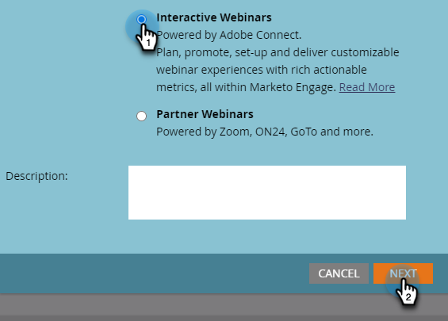

# Création d’un webinaire interactif {#create-an-interactive-webinar}

Créez un webinaire interactif en quelques étapes simples.

1. Accédez à **Activités marketing**.

   

1. Cliquez avec le bouton droit de la souris sur le dossier de votre choix, puis sélectionnez **Nouveau programme**.

   

1. Nommez le programme. Sous Type de programme, sélectionnez **Événement**.

   

1. Cliquez sur la liste déroulante Canal et sélectionnez **Webinaire**.

   

1. Choisir **Webinaires interactifs** et cliquez sur **Suivant**.

   

   >[!NOTE]
   >
   >Vous trouverez des informations sur les webinaires des partenaires ici.

1. Définissez la taille d’audience maximale de votre webinaire et la durée de ce dernier.

   

1. Planifiez la date/l’heure de votre webinaire et cliquez sur **Créer**.

   

Votre webinaire interactif est créé. Il est maintenant temps de [la conception](/help/marketo/product-docs/demand-generation/events/interactive-webinars/designing-interactive-webinars.md).

