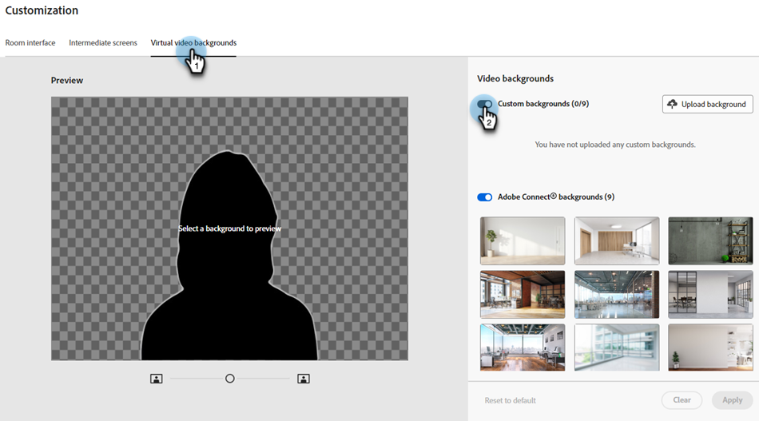
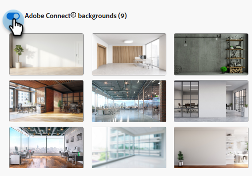

# Personnalisation des webinaires interactifs {#interactive-webinars-customization}

La personnalisation de vos webinaires est essentielle pour créer une expérience plus attrayante et plus efficace pour les participants.

Les webinaires interactifs offrent plusieurs options de personnalisation pour adapter l’environnement du webinaire à vos besoins. Personnalisez l’aspect de différents écrans pour refléter l’identité graphique de votre entreprise.

Vous pouvez personnaliser les options suivantes :

* Couleurs de marque de la chambre
* Arrière-plan personnalisé pour représenter votre organisation sur les écrans d’entrée, de sortie et d’attente
* Logo
* Arrière-plans vidéo virtuels

## Octroi des autorisations {#grant-permissions}

Avant que des utilisateurs de votre organisation puissent personnaliser vos webinaires interactifs, un administrateur Marketo Engage doit d’abord ajouter un accès au(x) rôle(s) souhaité(s).

1. Dans Marketo Engage, cliquez sur **[!UICONTROL Admin]**.

   

1. Cliquez sur **[!UICONTROL Utilisateurs et rôles]**, puis sur l’onglet **[!UICONTROL Rôles]**.

   

1. Double-cliquez sur le rôle auquel vous souhaitez ajouter les autorisations.

   

1. Cliquez pour ouvrir **[!UICONTROL Access Design Studio]**.

   

1. Cochez la case **[!UICONTROL Accéder à la personnalisation des webinaires interactifs]**.

   

## Personnalisation des écrans de webinaire interactif {#customize-interactive-webinar-screens}

1. Accédez au **Design Studio**.

   

1. Cliquez sur **Webinaires interactifs** et sélectionnez **Personnaliser les webinaires**.

   

1. Vous pouvez personnaliser l’interface de l’espace, les écrans immédiats ou les arrière-plans vidéo virtuels.

   

## Personnaliser l’interface de l’espace {#customize-the-room-interface}

Vous pouvez personnaliser l’apparence de la salle de session en modifiant le logo, le lien de redirection cliquable et les couleurs. Vos modifications seront répercutées dans tous les événements et salles de votre organisation.

Pour personnaliser l&#39;apparence d&#39;un espace, sélectionnez l&#39;onglet Interface de l&#39;espace dans la barre de menus.

1. Dans le panneau de droite, personnalisez les préférences suivantes :

   

   **Logo personnalisé** : sélectionnez Charger le logo et parcourez l’image à partir de votre appareil. La taille de l’image ne doit pas dépasser 50 x 31 pixels et peut être présentée dans différents formats de fichier : .svg, .gif, .jpg et .png. Vous pouvez modifier ou supprimer votre logo.

   **Lien de redirection** : ajoutez une URL pour rediriger vos participants après qu&#39;ils ont cliqué sur le logo.

   **Texte secondaire** : ajoutez un texte secondaire pour les participants à l’aide des fonctions d’accessibilité.

   **Couleurs** : sélectionnez les couleurs pour Barre d’espace, Icônes d’espace, Arrière-plan d’espace, Barre pod et Mosaïques/icônes pod pour modifier la couleur des différentes sections.

   Vous pouvez également saisir le code couleur HEX à l’aide de l’option HEX .

   Sélectionnez **[!UICONTROL Afficher les modèles]** pour modifier le thème de la pièce.

   Après avoir apporté les modifications, vous pouvez vérifier le logo et les couleurs dans l’aperçu.

1. Sélectionnez **[!UICONTROL Appliquer]** pour enregistrer les modifications. Pour rétablir les paramètres par défaut, cliquez sur **[!UICONTROL Réinitialiser aux paramètres par défaut]**.

   

### Personnalisation des écrans intermédiaires {#customize-intermediate-screens}

Modifiez l’image d’arrière-plan pour changer l’aspect des écrans d’entrée, de sortie et d’attente. Les modifications sont répercutées dans tous les événements et salles de votre organisation.

Pour personnaliser l’aspect d’une pièce, sélectionnez l’onglet Écrans intermédiaires dans la barre de menus.

1. Dans le panneau de droite, personnalisez l’image d’arrière-plan en sélectionnant **Télécharger l’image** et recherchez un logo dans une image. La taille de l’image ne doit pas dépasser 1 920 x 1 080 pixels et peut être présentée dans différents formats de fichier : .svg, .gif, .jpg et .png. Vous pouvez modifier ou supprimer le logo si vous le souhaitez.

   

   >[!NOTE]
   >
   >L’image chargée est appliquée sur les écrans Entrée, Sortie et En attente .

1. Sélectionnez **[!UICONTROL Appliquer]** pour enregistrer les modifications. Pour rétablir les paramètres par défaut, cliquez sur **[!UICONTROL Réinitialiser aux paramètres par défaut]**.

### Personnalisation des arrière-plans vidéo virtuels {#Customize-virtual-video-backgrounds}

Utilisez des arrière-plans définis par l’organisation lors de vos événements pour afficher le logo ou l’image de marque de votre organisation à l’arrière-plan de votre flux vidéo de caméra. Pour ajouter les arrière-plans virtuels de votre entreprise, sélectionnez l’onglet Arrière-plans vidéo virtuels dans la barre de menus. Vous pouvez choisir d’afficher uniquement les arrière-plans personnalisés, les arrière-plans Adobe Connect ou les deux.

**Arrière-plans personnalisés**

1. Cliquez sur le bouton (bascule) pour autoriser les arrière-plans personnalisés dans vos événements et salles.

   

1. Sélectionnez **Charger l’arrière-plan** pour charger un arrière-plan personnalisé. La taille de l’image ne doit pas dépasser 1 920 x 1 080 pixels et peut être présentée dans différents formats de fichier : .svg, .gif, .jpg et .png.

Pointez sur l’image d’arrière-plan personnalisée pour la supprimer des arrière-plans vidéo.

Après avoir apporté les modifications, affichez l’arrière-plan dans l’aperçu.

Vous pouvez utiliser le curseur dans l’écran Aperçu pour effectuer un zoom avant ou arrière et tester l’aspect de l’arrière-plan virtuel si l’utilisateur se trouvait à proximité ou à distance de la caméra. S’il existe du texte en arrière-plan, cela permet de s’assurer qu’il reste visible.

1. Sélectionnez **[!UICONTROL Appliquer]** pour enregistrer les modifications. Pour rétablir les paramètres par défaut, cliquez sur **[!UICONTROL Réinitialiser aux paramètres par défaut]**.

**Arrière-plans Adobe Connect**

Adobe Connect fournit neuf fonds d’écran par défaut prêts à l’emploi. Vous pouvez voir leur apparence dans l’aperçu.

Utilisez le bouton (bascule) pour contrôler la disponibilité de ces arrière-plans par défaut dans vos événements et salles.

Sélectionnez **Appliquer** pour enregistrer les modifications ou **Réinitialiser aux paramètres par défaut** pour réinitialiser aux paramètres par défaut.

### Créer Des Thèmes Personnalisables {#create-customizable-themes}

* Les administrateurs peuvent créer/gérer des thèmes avec des logos, des couleurs et des arrière-plans vidéo personnalisés.

* Les hôtes peuvent choisir des thèmes pendant la création de la salle ou les mettre à jour ultérieurement à partir de la page d&#39;informations de la salle (**Barre supérieure de la salle** > **Menu Plus** > **Afficher les informations de la salle**).

En savoir plus sur les [thèmes](https://helpx.adobe.com/adobe-connect/connect-central-admin/connect-central-ui-customization-basics.html){target="_blank"}.
