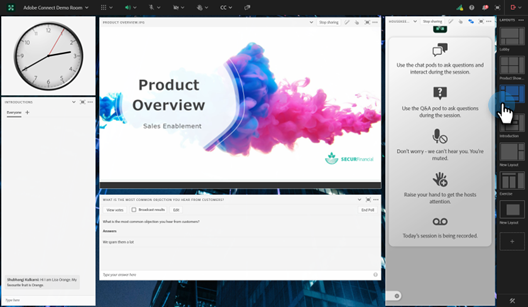

# Diffuser un webinaire interactif {#deliver-an-interactive-webinar}

Votre webinaire interactif est prêt à être lancé. Apprenez tout ce que vous devez savoir sur la présentation.

1. Sélectionnez votre événement et cliquez sur **Entrez votre webinaire**.

   

   >[!NOTE]
   >
   >Il est recommandé de le faire au moins 15 minutes avant l’heure de début prévue.

1. Si vous êtes co-animateur ou présentateur, cliquez sur le lien personnalisé dans l’e-mail que vous avez reçu pour le webinaire.

1. Sélectionnez vos préférences audio/vidéo et cliquez sur **Entrez dans l’espace**.

   

1. Sélectionnez la mise en page à afficher pour les premiers utilisateurs.

   

   >[!NOTE]
   >
   >Les participants peuvent entrer dans la salle jusqu&#39;à 15 minutes avant le début prévu et verront la mise en page active. Nous vous recommandons de concevoir un aménagement «  Lobby «  pour eux.

   >[!TIP]
   >
   >Activez les contrôles de diffusion pour accéder à un espace vert virtuel. Cela permet aux animateurs et aux présentateurs de parler en privé et de se voir sans que l&#39;audio et la vidéo ne soient diffusés aux participants dans la salle. Idéal avant et après la session, il vous permet de tester votre contenu audio et vidéo ou de faire un compte rendu après le webinaire.

1. Si nécessaire, vous pouvez enregistrer la session. Sélectionnez **Enregistrer la session** dans le menu de la salle. L’enregistrement peut être arrêté ultérieurement à partir du même menu.

   

1. Votre session commence à l’heure indiquée.

1. Cliquez sur le nom de la salle. Dans la liste déroulante, sélectionnez **Zone Hôte et présentateur** pour discuter ou partager des notes avec l&#39;équipe de présentation dans les coulisses. La zone d’accueil et de présentation s’ouvre dans la partie droite de l’écran. Seuls les hôtes/co-hôtes et les présentateurs peuvent voir cette partie de l&#39;écran.

   

1. Une fois la session terminée, cliquez sur l’icône de flèche rouge et sélectionnez **Terminer la session pour tous**.

   

   >[!CAUTION]
   >
   >Cliquer sur la sortie de la salle ne fera que vous faire quitter la salle. Il ne terminera **pas** le webinaire.

   >[!TIP]
   >
   >En savoir plus sur les [performances et enregistrements des événements](/help/marketo/product-docs/demand-generation/events/interactive-webinars/event-workflows.md){target="_blank"}.

## Expérience du participant {#participant-experience}

Les participants peuvent rejoindre le webinaire en cliquant sur le lien personnalisé reçu après s’être inscrit à l’événement.

1. Les participants qui lancent le lien de l’événement plus de 15 minutes avant le début prévu verront une page de destination les informant d’attendre le début de l’événement.

   

1. Les participants doivent sélectionner leurs préférences audio, puis cliquer sur Entrer dans la salle. Les participants qui rejoignent une salle Adobe Connect pour la première fois verront également une fenêtre contextuelle du navigateur pour obtenir l’autorisation du microphone. Adobe Connect a besoin de cet accès pour que les participants puissent utiliser leur microphone plus tard dans la salle.

   

   >[!NOTE]
   >
   >Il est possible de fermer la fenêtre contextuelle d’autorisation sans fournir l’accès. Les participants devront fournir un accès à l&#39;intérieur de la salle s&#39;ils tentent d&#39;activer leur microphone.

## Paramètres et zones {#settings-and-areas}

### Zone Hôte et Présentateur {#host-and-presenter-area}

La « zone des animateurs et des présentateurs » (également appelée « backstage ») est une zone privée située sur le côté droit d&#39;une salle de réunion que seuls les animateurs et les présentateurs peuvent voir. Il permet de collaborer avant, pendant et après un événement. Utilisez le Module de conversation, les Notes et d’autres pods comme canaux secondaires dans la zone Hôte et présentateur .

Pour y accéder, sélectionnez **Zone d’accueil et de présentation** dans le menu déroulant de la salle. En savoir plus sur cette zone dans la [vidéo suivante](https://www.youtube.com/watch?v=11GkcvIUttY){target="_blank"}.

### Contrôles de diffusion {#broadcast-controls}

Broadcast Control ajoute une salle verte virtuelle à votre session de webinaires interactifs. Il permet aux hôtes et aux présentateurs de parler et de se voir en privé sans diffuser aux participants dans la salle. C&#39;est un excellent moyen de tester votre microphone et votre webcam avant une session. Les présentateurs peuvent également collaborer dans la zone Hôte et présentateur jusqu’à ce qu’ils soient prêts à passer en ligne. Il permet au conférencier et aux producteurs de faire le point entre eux en privé après une séance, au cas où un participant oublierait de quitter le webinaire.

Les commandes de diffusion peuvent être configurées pour commencer automatiquement l&#39;enregistrement après que vous avez quitté la salle verte. Ainsi, les hôtes n’ont pas à se rappeler de démarrer et d’arrêter manuellement l’enregistrement. La suspension ou l’arrêt de la diffusion entraîne également la suspension ou l’arrêt de l’enregistrement. Tout est automatique.

En savoir plus sur les contrôles de diffusion [dans cette vidéo](https://www.youtube.com/watch?v=TcoCeEJoyjg){target="_blank"}.

### Conversations dans les enregistrements {#chats-in-recordings}

Selon le cas d’utilisation, il peut être préférable d’inclure ou d’exclure la discussion en salle des enregistrements d’événement.

Les discussions dans les capsules de conversation sont toujours enregistrées. Ainsi, si les discussions de chat ajoutent de la valeur aux visionneuses d’enregistrement (les participants et les visionneuses à la demande publient l’événement en direct), utilisez les capsules de chat lors de la conception de la salle.

Les discussions au sein du groupe de discussion ne sont pas enregistrées. Le panneau de conversation libère également l&#39;espace qui aurait été occupé par le pod de chat dans la disposition. Ainsi, si les discussions de chat ne vont pas ajouter de la valeur aux visionneuses d&#39;enregistrement, utilisez le panneau de chat au lieu des pods de chat lors de la conception de la salle.

En savoir plus sur [le panneau de conversation](https://helpx.adobe.com/adobe-connect/using/notes-chat-q-a-polls.html#chat_panel){target="_blank"}.

### Mode de préparation {#prepare-mode}

Le mode Préparer permet aux hôtes et aux présentateurs de créer ou de modifier l&#39;agencement d&#39;une salle de réunion en arrière-plan pendant une session, mais sans que les participants ne voient les modifications tant que l&#39;hôte ne les rend visibles. La fonction Mode de préparation met en surbrillance les capsules actives en bleu et les capsules non actives en blanc.

Pour utiliser le mode de préparation :

1. Cliquez sur l’icône en forme de clé à molette au bas du panneau Dispositions .

   

1. Dans le panneau Mises en page , choisissez la mise en page à ajuster. Déplacez, masquez ou affichez les capsules selon vos besoins. Vous pouvez également mettre à jour le contenu d&#39;une capsule, par exemple télécharger une nouvelle version de la présentation dans une capsule partagée.

1. Une fois les modifications effectuées, choisissez **Terminer le mode de préparation** dans le menu déroulant ou cliquez une seconde fois sur l’icône clé à molette.

Cette option désactive le mode Préparer et vous ramène à la disposition active.

En savoir plus sur le mode de préparation [dans cette vidéo](https://www.youtube.com/watch?v=kUya84sx-E4){target="_blank"}.

>[!NOTE]
>
>* Toutes les modifications apportées aux capsules en direct sont immédiatement répercutées sur les participants.
>* Le [panneau de conversation](https://helpx.adobe.com/adobe-connect/using/notes-chat-q-a-polls.html#chat_panel){target="_blank"} ne fait pas partie du mode Préparer et toute modification apportée sera immédiatement répercutée sur les participants.

### Accessibilité {#accessibility}

Adobe s’efforce d’inclure les présentateurs et les participants présentant un handicap en améliorant l’accessibilité des webinaires interactifs. Le logiciel est continuellement amélioré pour répondre aux besoins de tous les types d&#39;utilisateurs et pour se conformer aux normes mondiales qui incluent les personnes ayant une déficience visuelle, auditive, de mobilité ou d&#39;autres déficiences.

Découvrez comment Adobe Connect fournit une assistance pour les besoins [ visuels, auditifs et de mobilité](https://helpx.adobe.com/adobe-connect/using/accessibility-features.html){target="_blank"}.

### Sous-titres {#closed-captions}

Les sous-titres sont une représentation textuelle de l’audio dans une salle Adobe Connect et aident les participants sourds ou malentendants à participer aux événements. Vous pouvez intégrer des sous-titres en temps réel du contenu audio dans les événements et présenter ces sous-titres dans l’affichage Sous-titrage.

Découvrez comment [activer les sous-titres](https://helpx.adobe.com/adobe-connect/using/closed-captioning-html-client.html){target="_blank"}.
