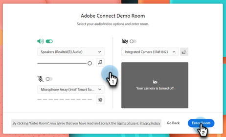
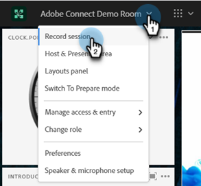
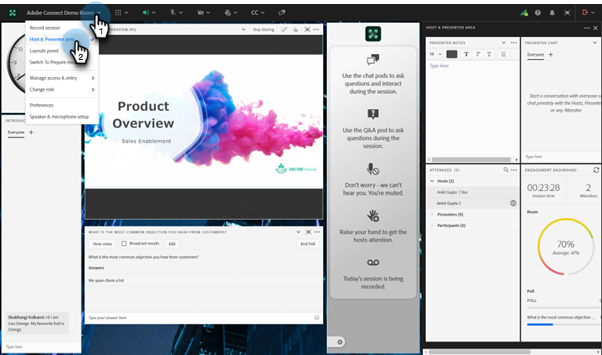

# Diffusion d’un webinaire interactif {#deliver-an-interactive-webinar}

Votre webinaire interactif est prêt à l’emploi. Apprenez tout ce que vous avez besoin de savoir sur la présentation.

1. Sélectionnez votre événement et cliquez sur **Saisissez votre webinaire**.

   

   >[!NOTE]
   >
   >Il est recommandé de le faire au moins 15 minutes avant l’heure de début planifiée.

1. Si vous êtes co-hôte ou présentateur, cliquez sur le lien personnalisé dans l’e-mail que vous avez reçu pour le webinaire.

   

1. Sélectionnez vos préférences audio/vidéo et cliquez sur **Entrée dans la salle**.

   

1. Sélectionnez la mise en page à afficher aux jointures anticipées.

   

   >[!NOTE]
   >
   >Les participants peuvent entrer dans la pièce jusqu&#39;à 15 minutes avant le début prévu et verront la disposition active. Nous vous recommandons de concevoir une mise en page &quot;Lobby&quot; pour eux.

   >[!TIP]
   >
   >Activez les Contrôles de diffusion pour entrer dans une zone verte virtuelle. Cela permet aux hôtes et aux présentateurs de parler en privé et de se voir sans que l&#39;audio et la vidéo ne soient diffusés aux participants de la salle. C’est l’idéal avant et après la session, où vous pouvez tester votre audio et vidéo ou faire un résumé après le webinaire.

1. Vous pouvez enregistrer la session si nécessaire. Sélectionnez **Enregistrer la session** dans le menu de la salle. L’enregistrement peut être arrêté ultérieurement à partir du même menu.

   

1. Votre session commence au moment indiqué.

1. Cliquez sur le nom de la pièce. Dans la liste déroulante, sélectionnez **Espace hôte et présentateur** pour discuter ou partager des notes avec l’équipe de présentation en coulisses. La zone hôte et présentateur s’ouvre sur le côté droit de l’écran. Seuls les hôtes/co-hôtes et les présentateurs peuvent voir cette partie de l’écran.

   

1. Une fois la session terminée, cliquez sur l’icône de flèche rouge et sélectionnez **Terminer la session pour tous les**.

   

   >[!CAUTION]
   >
   >Cliquer sur la sortie de la pièce vous fera quitter la pièce. Il **et non** mettra fin au webinaire.

   >[!TIP]
   >
   >En savoir plus sur les [performances et enregistrements d’événement](/help/marketo/product-docs/demand-generation/events/interactive-webinars/event-workflows.md){target="_blank"}.

## Expérience des participants {#participant-experience}

Les participants peuvent participer au webinaire en cliquant sur le lien personnalisé reçu après s’être inscrits à l’événement.

1. Les participants qui lancent le lien de l’événement plus de 15 minutes avant le début prévu verront une landing page les informant d’attendre le début de l’événement.

   

1. Les participants doivent sélectionner leurs préférences audio, puis cliquer sur Entrée dans la salle. Les participants qui rejoignent une salle Adobe Connect pour la première fois verront également une fenêtre contextuelle pour obtenir une autorisation avec un microphone. Adobe Connect a besoin de cet accès pour que les participants puissent utiliser leur micro plus tard dans la salle.

   

   >[!NOTE]
   >
   >La fenêtre contextuelle d’autorisation peut être fermée sans accès. Les participants devront fournir un accès dans la pièce s&#39;ils essaient d&#39;activer leur micro.

## Paramètres et zones {#settings-and-areas}

### Zone Hôte et présentateur {#host-and-presenter-area}

La &quot;zone d’accueil et de présentation&quot; (également appelée &quot;coulisses&quot;) est une zone privée située sur le côté droit d’une salle de réunion que seuls les hôtes et les présentateurs peuvent voir. Il peut être utilisé pour collaborer avant, pendant et après un événement. Utilisez Chat, Notes et autres capsules comme canaux d’arrière-plan dans la zone Hôte et présentateur.

Pour y accéder, sélectionnez **Espace hôte et présentateur** dans le menu déroulant de la salle. Pour en savoir plus sur cette zone, reportez-vous à la [vidéo suivante](https://www.youtube.com/watch?v=11GkcvIUttY){target="_blank"}.

### Contrôles de diffusion {#broadcast-controls}

Le contrôle de diffusion ajoute une pièce verte virtuelle à votre session de webinaires interactifs. Il permet aux hôtes et aux présentateurs de s&#39;exprimer et de se voir en privé sans diffuser aux participants de la salle. C&#39;est un excellent moyen de tester votre micro et votre webcam avant une session. Les présentateurs peuvent également collaborer dans la zone Hôte et présentateur jusqu’à ce qu’ils soient prêts à être mis en ligne. Il permet à l&#39;orateur et aux producteurs de se parler en privé après une session, au cas où un participant oublierait de quitter le webinaire.

Les commandes de diffusion peuvent être configurées pour commencer automatiquement l’enregistrement une fois que vous avez quitté la pièce verte. Cela permet aux hôtes de ne pas avoir à se souvenir de démarrer et arrêter manuellement l’enregistrement. La suspension ou l’arrêt de la diffusion interrompt ou arrête également l’enregistrement. Tout est automatique.

Pour en savoir plus sur les commandes de diffusion [dans cette vidéo](https://www.youtube.com/watch?v=TcoCeEJoyjg){target="_blank"}.

### Conversations dans les enregistrements {#chats-in-recordings}

Selon le cas d’utilisation, il peut être judicieux d’inclure ou d’exclure la conversation en chambre dans les enregistrements d’événement.

Les discussions dans les capsules de conversation sont toujours enregistrées. Ainsi, si les discussions de chat ajoutent de la valeur à l’enregistrement des téléspectateurs (les participants et les téléspectateurs à la demande publient l’événement en direct), utilisez les capsules lors de la conception de la salle.

Les discussions dans le panneau de discussion ne sont pas enregistrées. Le panneau de conversation libère également l&#39;espace qui aurait été occupé par la capsule dans la disposition. Donc, si les discussions de chat ne vont pas ajouter de valeur à l&#39;enregistrement des téléspectateurs, utilisez le panneau de discussion au lieu des capsules lors de la conception de la salle.

En savoir plus sur [le panneau de conversation](https://helpx.adobe.com/adobe-connect/using/notes-chat-q-a-polls.html#chat_panel){target="_blank"}.

### Mode de préparation {#prepare-mode}

Le mode de préparation permet aux hôtes et aux présentateurs de créer ou de modifier une disposition de salle de réunion en arrière-plan pendant la session, mais sans que les participants voient les modifications jusqu’à ce que l’hôte les rende visibles. La fonction Mode de préparation met en surbrillance les capsules en bleu et les capsules non actives en blanc.

Pour utiliser le mode de préparation :

1. Cliquez sur l’icône de clé à molette située au bas du panneau Disposition.

   

1. Dans le panneau Mises en page, choisissez la mise en page à ajuster. Déplacez, masquez ou affichez des capsules selon vos besoins. Vous pouvez également mettre à jour le contenu des capsules, par exemple charger une nouvelle version de présentation dans une capsule de partage.

1. Une fois les modifications effectuées, sélectionnez **Terminer le mode de préparation** dans le menu déroulant ou cliquez une seconde fois sur l’icône de clé à molette.

Cela désactive le mode de préparation et vous ramène à la mise en page active.

En savoir plus sur le mode de préparation [ dans cette vidéo ](https://www.youtube.com/watch?v=kUya84sx-E4){target="_blank"}.

>[!NOTE]
>
>* Toute modification apportée aux capsules actives est immédiatement répercutée sur les participants.
>* [Panneau de conversation](https://helpx.adobe.com/adobe-connect/using/notes-chat-q-a-polls.html#chat_panel){target="_blank"} ne fait pas partie du mode de préparation et toute modification y est répercutée instantanément sur les participants.

### Accessibilité {#accessibility}

Adobe s’efforce d’inclure les présentateurs et les participants présentant un handicap en améliorant l’accessibilité des webinaires interactifs. Le logiciel est continuellement amélioré pour répondre aux besoins de tous les types d’utilisateurs et pour se conformer aux normes mondiales qui incluent les personnes ayant des déficiences visuelles, auditives, mobiles ou autres.

Découvrez comment Adobe Connect fournit de l’aide pour les [besoins visuels, auditifs et de mobilité](https://helpx.adobe.com/adobe-connect/using/accessibility-features.html){target="_blank"}.

### Sous-titres codés {#closed-captions}

Les sous-titres codés sont une représentation textuelle du son dans une salle Adobe Connect et aident les participants sourds ou malentendants à participer aux événements. Vous pouvez intégrer le sous-titrage en temps réel du contenu audio dans les événements et présenter ces sous-titres dans l’affichage Sous-titrage codé.

Découvrez comment [activer les sous-titres fermés](https://helpx.adobe.com/adobe-connect/using/closed-captioning-html-client.html){target="_blank"}.
