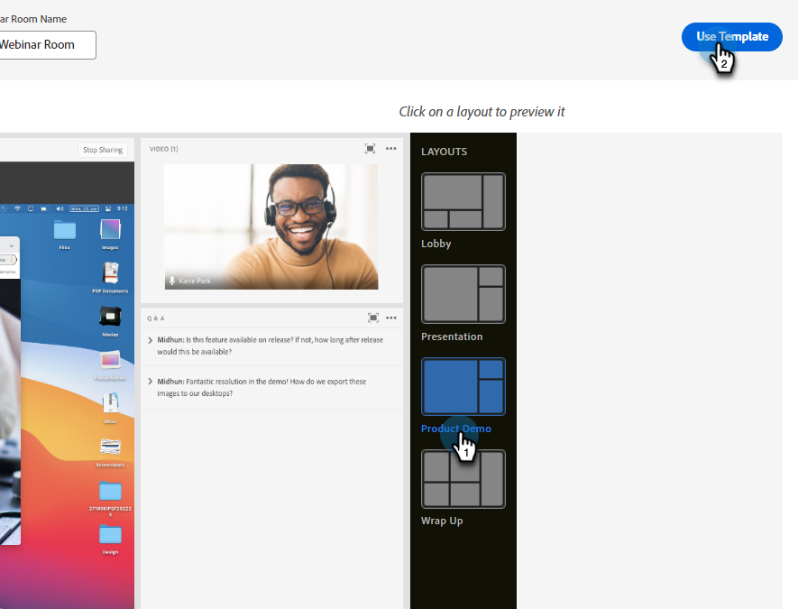

# Concevoir des webinaires interactifs {#designing-interactive-webinars}

Découvrez comment concevoir votre webinaire en fonction de vos besoins.

1. Sélectionnez votre événement et cliquez sur **Concevoir votre webinaire**.

   

1. Vous pouvez choisir une salle de webinaires existante ou en créer une nouvelle. Dans cet exemple, nous en créons un nouveau. Cliquez donc sur le menu déroulant **Sélectionner une salle** et choisissez **Nouvelle salle de webinaire interactif**.

   

   >[!NOTE]
   >
   >* Une salle est un espace en ligne qui est utilisé pour tenir des réunions.
   >
   >* Si vous choisissez une salle de webinaires existante et que vous devez la renommer, cliquez simplement sur le bouton **Renommer la salle de webinaires** à droite.
   >
   >* La liste déroulante affiche uniquement les chambres existantes que vous avez créées précédemment, et non celles des autres hôtes.

1. Choisissez un modèle.

   

1. L’aperçu de votre webinaire s’affiche.

   

   >[!NOTE]
   >
   >Par défaut, le nom de la salle indiqué dans le champ « Nom de la salle de webinaire interactif » est identique à celui de votre programme d’événement de webinaire interactif. Vous avez la possibilité de le modifier pour refléter le titre du webinaire lui-même, puisque ce nom est visible par votre audience.

   >[!TIP]
   >
   >Votre webinaire sera défini sur la langue par défaut dans votre instance de Marketo Engage, mais vous avez la possibilité de modifier les langues par webinaire à l’aide de la liste déroulante au-dessus de l’aperçu.

1. Vous pouvez sélectionner différentes dispositions à prévisualiser. Pour continuer, cliquez sur **Utiliser le modèle**.

   

1. Vous pouvez affiner votre webinaire immédiatement ou ultérieurement. Faisons-le maintenant. Cliquez Sur **Affiner Votre Webinaire Maintenant**.

   

1. Sélectionnez vos préférences audio/vidéo et cliquez sur **Entrez dans l’espace**.

   

1. Le modèle sélectionné est désormais modifiable.

   

1. Pour plus d’informations sur les salles et les modèles, consultez la section « Modèles et dispositions des salles de réunion » de [cet article d’aide d’Adobe](https://helpx.adobe.com/in/adobe-connect/using/creating-arranging-meetings.html#creating_and_arranging_meetings){target="_blank"}.

1. Une fois le webinaire conçu, cliquez sur **Quitter la salle**.

   

## Éléments de conception {#design-elements}

**Modèle** : structure fournie à une salle en fonction de l’objectif du webinaire diffusé. Par exemple, si vous souhaitez planifier un webinaire de présentation de produit, le partage d’écran est un composant essentiel pour présenter la démonstration. Le modèle garantit que les composants essentiels requis pour une diffusion efficace d’un type particulier de webinaire sont en place lors de la configuration de la salle de webinaire.

**Disposition** : fait référence à différentes manières dont les différents composants requis pour assurer la réussite du webinaire sont organisés dans un modèle particulier. Un seul modèle peut avoir plusieurs dispositions parmi lesquelles vous pouvez choisir. Les composants essentiels du webinaire resteraient les mêmes dans tous les modèles. L’arrangement que vous avez sélectionné serait le mieux adapté au style/aux besoins de votre personne ou du présentateur qui présente le webinaire.

**Pod** : composant à l’intérieur d’un modèle qui effectue une activité particulière pendant le webinaire. Par exemple, la configuration et la diffusion d’un sondage pour capturer les réponses des participants dans une activité qui peut être réalisée par un sondage. De même, discuter avec les participants pour transmettre un message ou interagir avec eux de manière informelle peut être une activité proposée par le biais du module de conversation. Plusieurs autres pods sont disponibles, tels que Partager, Notes, Vidéo, Conversation, Liste des participants, Fichiers, Liens web, Sondages et Questions/Réponses.

      **Survey Pod** : permet aux hôtes de concevoir et de diffuser des formulaires de commentaires structurés directement dans une session en direct. La capsule de sondage étend les capacités existantes de la capsule de sondage en permettant de présenter plusieurs questions ensemble, offrant ainsi un moyen plus rationalisé et plus cohérent de recueillir les commentaires des participants. [En savoir plus](https://helpx.adobe.com/adobe-connect/using/survey-pod.html){target="_blank"}

      **pod de ressources** : remplace les pods de fichiers et de liens web précédents, fournissant un moyen unique et unifié de partager des ressources pendant les sessions en direct. [En savoir plus](https://helpx.adobe.com/adobe-connect/using/resources-pod.html){target="_blank"}

>[!MORELIKETHIS]
>
>[Découvrez comment ajouter des présentateurs et/ou des co-hôtes](/help/marketo/product-docs/demand-generation/events/interactive-webinars/add-a-webinar-team.md){target="_blank"}
