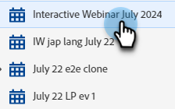
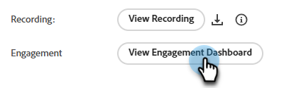
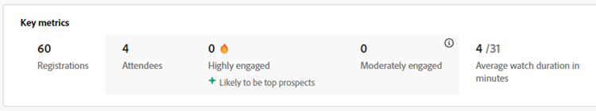
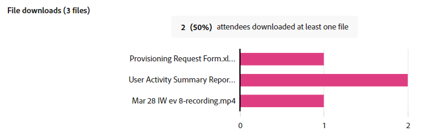
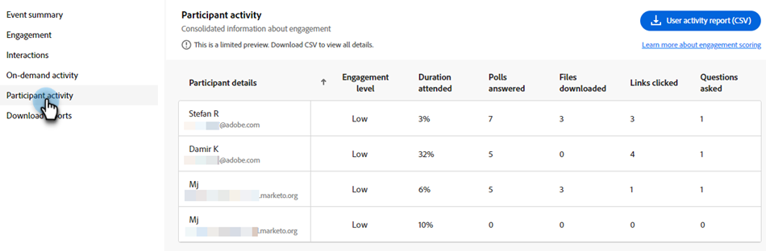

# Tableau de bord des engagements {#engagement-dashboard}

Les webinaires interactifs proposés par Adobe Connect utilisent différentes capsules pour impliquer les participants dans les tchats, les questions et réponses, les questionnaires et les sondages. Le tableau de bord des engagements vous permet de suivre les mesures clés et les visualisations des données.

Afficher une vue consolidée des activités, interactions et engagements des participants au cours d’un événement. En tant qu’hôte, vous pouvez afficher les performances des événements en direct et à la demande et télécharger divers rapports après la session. En outre, les rapports de post-webinaires générés à partir du tableau de bord sont utilisés pour évaluer l’efficacité de la session, informer le contenu futur et améliorer la stratégie globale du webinaire.

Le tableau de bord effectue le suivi de diverses mesures, notamment des réponses aux sondages, de l’activité de chat et des interactions vidéo, offrant des informations précieuses sur les préférences et les comportements des participants. Il offre un aperçu complet de l’activité des participants et des niveaux d’engagement, ce qui permet aux hôtes de surveiller la participation, la participation et les interactions en temps réel.

Affichez l’engagement pour les types de sessions suivants dans un webinaire interactif.

* **Session en direct** : session en ligne en temps réel où les participants peuvent interagir activement les uns avec les autres.
* **Session à la demande** : l’enregistrement de l’événement en direct est rendu disponible en tant qu’événement propre. Les nouvelles invités peuvent enregistrer et regarder l&#39;enregistrement. Une fois enregistrés, ils reçoivent un lien de jointure d’événement qui les amène à l’enregistrement de l’événement une fois qu’il se termine. Les participants inscrits à l&#39;événement peuvent également consulter l&#39;enregistrement en cliquant sur le même lien de jointure.

## Affichage du tableau de bord {#view-the-dashboard}

1. Accédez à **[!UICONTROL Activités marketing]**.

   

1. Sélectionnez l’événement terminé de votre choix.

   

1. Dans l’aperçu, cliquez sur **[!UICONTROL Afficher le tableau de bord de l’engagement]**.

   

   >[!NOTE]
   >
   >Le tableau de bord de l’engagement est accessible 45 à 120 minutes après la fin de l’événement planifié.

## Détails du tableau de bord {#dashboard-details}

Vous pouvez afficher les détails suivants dans le tableau de bord de l’engagement.

<table><tbody>
  <tr>
    <td><b>Synthèse des événements</td>
    <td>Fournit une vue consolidée des performances des sessions en direct et à la demande.</td>
  </tr>
  <tr>
    <td><b>Engagement</td>
    <td>Fournit un aperçu des performances des sessions en direct.</td>
  </tr>
  <tr>
    <td><b>Interactions</td>
    <td>Fournit une vue détaillée de l’engagement des participants dans toutes les capsules.</td>
  </tr>
  <tr>
    <td><b>Activité à la demande</td>
    <td>Fournit un résumé des performances de l’enregistrement.</td>
  </tr>
  <tr>
    <td><b>Activité de participant</td>
    <td>Fournit une vue consolidée de l’engagement.</td>
  </tr>
  <tr>
    <td><b>Téléchargement de rapports</td>
    <td>Téléchargez des rapports d’engagement dans différentes capsules.</td>
  </tr>
</tbody>
</table>

### Synthèse des événements {#event-summary}

Cette interface fournit une vue consolidée des performances de l’événement pour les sessions en direct et à la demande. Dans le panneau de gauche, sélectionnez Résumé de l’événement pour afficher les mesures globales.

<table><tbody>
  <tr>
    <td><b>Total des inscriptions</td>
    <td>Indique le nombre de participants qui se sont inscrits à l’événement.</td>
  </tr>
  <tr>
    <td><b>Nombre total de participants</td>
    <td>Ceci indique le nombre de participants qui ont assisté à l’événement.</td>
  </tr>
  <tr>
    <td><b>Abonnement au taux de conversion des participants</td>
    <td>Ceci indique le pourcentage de participants qui se sont inscrits et ont assisté à l'événement.</td>
  </tr>
  <tr>
    <td><b>Les visiteurs ont assisté en direct et à la demande.</td>
    <td>Cela indique le nombre de participants qui ont assisté à des événements en direct et à la demande.</td>
  </tr>
</tbody>
</table>

### Engagement {#engagement}

Fournit un aperçu des performances d’un événement de la session en direct. La présentation comprend des mesures clés, l’engagement au fil du temps et les interactions des participants. Il aide les organisateurs à évaluer le succès de l’événement et à identifier les domaines à améliorer.

Dans le panneau de gauche, sélectionnez **[!UICONTROL Engagement]** pour afficher les performances de la session en direct. **[!UICONTROL Cliquez sur Synthèse de l’engagement (PDF)]** pour télécharger le résumé des performances de la session en direct. La présentation fournit des données dans différentes sections.

**Mesures clés**

Affichez le nombre d’inscriptions, de participants et d’engagements dans la session en direct.

<table><tbody>
  <tr>
    <td><b>Inscriptions</td>
    <td>Affichez le nombre d’enregistrements pour la session en direct.</td>
  </tr>
  <tr>
    <td><b>Attente</td>
    <td>Afficher le nombre de participants présents à la session en direct.</td>
  </tr>
  <tr>
    <td><b>Très engagé</td>
    <td>Afficher le nombre de participants qui ont été fortement engagés au cours de la session en direct et qui sont susceptibles d’être les meilleures perspectives.</td>
  </tr>
  <tr>
    <td><b>Engagement modéré</td>
    <td>Afficher le nombre de participants modérément engagés au cours de la session en direct.
     <b>Remarque</b> : Ces chiffres sont calculés en fonction de l’engagement et des interactions au cours de la session.</td>
  </tr>
  <tr>
    <td><b>Durée moyenne de la montre en minutes</td>
    <td>Affiche la durée moyenne de la montre en minutes de la session en direct.</td>
  </tr>
</tbody>
</table>

**Engagement dans le temps**

Découvrez l’engagement moyen au fil du temps au cours de la session en direct à partir des graphiques d’engagement. Les hôtes peuvent surveiller la fluctuation des niveaux d’engagement, ce qui leur permet d’identifier les moments critiques d’une interaction élevée ou faible. Voir la quantité de note d’engagement moyenne obtenue par les participants engagés dans différentes dispositions.

Pointez sur le graphique pour afficher les informations suivantes :

* Heure à laquelle le niveau d’engagement est surveillé.
* Note moyenne d’engagement à ce moment-là.
* Nombre de participants engagés à ce moment.
* Disposition de l’engagement à ce moment-là.
* Sélectionnez **[!UICONTROL Afficher l’instant dans l’enregistrement]** pour afficher l’instant dans l’enregistrement où l’engagement était élevé ou faible.
* Score d’engagement moyen (%) au fil du temps dans la session
* Présence au fil du temps pendant la session
* L’engagement dans différentes mises en page de webinaire s’affiche lorsque différentes mises en page ont été utilisées dans la salle au cours de l’événement. Cela permet de corréler l’augmentation et la baisse de l’engagement dans différentes dispositions.

**Interactions de participants**

Vous pouvez afficher les interactions des participants à partir de différentes capsules. Il fournit des informations telles que Réponses aux questions, Interagir avec le chat, A cliqué sur au moins un lien et Téléchargé au moins un fichier.

Sélectionnez **[!UICONTROL Aller aux interactions]** pour afficher les réponses issues des sondages, des mesures de Q&amp;R et des réactions des participants au cours de la session. Découvrez comment les participants sont engagés dans plusieurs capsules à partir d’ Interactions et téléchargez des rapports d’interaction à partir de la section ci-dessous.

### Interactions {#interactions}

Affichez la manière dont les participants interagissent et participent à la session dans Interactions. Suivez les réponses aux sondages, aux mesures Q&amp;R, aux réactions des participants, ainsi que les liens et fichiers déposés depuis les capsules respectives. Les hôtes peuvent également télécharger des rapports d’interaction de ces capsules pour une meilleure analyse. En analysant ces interactions, vous pouvez identifier les tendances et ajuster leurs stratégies afin d’encourager un environnement plus interactif et plus engageant.

Dans le panneau de gauche, sélectionnez **[!UICONTROL Interactions]** pour afficher la façon dont les participants sont engagés dans toutes les capsules.

Sélectionnez l’onglet **[!UICONTROL Sondages]** de la barre de menus pour afficher les questions et réponses ajoutées au sondage. Cet onglet affiche les informations suivantes :

* Sélectionnez **[!UICONTROL Rapport Sondage (CSV)]** pour télécharger le rapport pour les interactions dans la capsule de sondage.
* La question du sondage et son type.
* Nombre de réponses et période pendant laquelle la capsule de sondage a été ouverte et engagée.
* Sélectionnez **Afficher toutes les `<number>` réponses** pour les afficher dans une fenêtre de boîte de dialogue.

Sélectionnez l’onglet **[!UICONTROL Autres interactions]** dans la barre de menus pour afficher l’engagement dans d’autres capsules et télécharger leurs rapports.

Sélectionnez **[!UICONTROL Télécharger les rapports d’interaction]** dans la liste déroulante pour télécharger les rapports de différentes capsules. Téléchargez le rapport Q&amp;R, le rapport Liens et fichiers et le rapport Réactions à partir de là pour un meilleur suivi.

Les informations sur l’engagement dans les capsules sont disponibles dans différentes sections.

**Mesures Q&amp;R**

Affichez les attributs suivants de la capsule Q&amp;R.

* Nombre total de questions posées.
* Nombre de questions sans réponse.
* Nombre de participants qui ont posé des questions.
* Nombre de participants qui ont posé plus d’une question susceptible d’être les meilleurs candidats.
* Temps moyen nécessaire pour répondre à une question.

**Réactions**

Vous pouvez voir les réactions des participants d&#39;ici, comme s&#39;accorder, désapprouver, applaudir et rire pendant la session.

Sur le graphique des réactions, vous pouvez voir les détails suivants :

* Réactions totales
* Nombre de participants ayant réagi au moins une fois
* Nombre total de clics
* Participant unique
* Tendance des clics sur les réactions en fonction du nombre total de clics sur les participants uniques.

**Pod de liens Web**

Afficher les liens ajoutés à la capsule de liens Web au cours de la session et le nombre de clics sur le lien partagé. La capsule de liens Web vous permet d’ajouter des liens à partir de sources en dehors du webinaire pour générer un engagement.

Sur le graphique, affichez les détails suivants :

* Liens ajoutés à la capsule de liens Web.
* Nombre de participants ayant cliqué sur au moins un lien.
* Nombre de liens lancés par l’hôte.
* Tendance des clics uniques sur chaque lien ajouté à la capsule de liens Web.

**Pod de fichiers**

Affichez les fichiers ajoutés à la capsule de fichiers au cours de la session et le nombre de téléchargements uniques. La capsule Fichiers vous permet d’ajouter des fichiers et de fournir des ressources pour générer l’engagement.

Sur le graphique, affichez les détails suivants :

* Nom des fichiers ajoutés à la capsule de fichiers.
* Nombre de participants ayant téléchargé au moins un fichier.
* Tendance des téléchargements uniques sur chaque fichier ajouté à la capsule de liens Web.

### Activité à la demande {#on-demand-activity}

Dans le panneau de gauche, sélectionnez **[!UICONTROL Activité à la demande]** pour afficher la synthèse des enregistrements. Vous pouvez également télécharger un rapport pour l’activité à la demande.

Dans l’activité à la demande, consultez les mesures suivantes :

* Cliquez sur **[!UICONTROL Rapport à la demande (CSV)]** pour télécharger les mesures à la demande.
* Nombre de visionneuses uniques jusqu’à la dernière actualisation du tableau de bord.
* Nombre de visiteurs qui ont consulté l’enregistrement mais n’ont pas pu assister au webinaire.
* Nombre de visiteurs ayant assisté au webinaire et consulté l’enregistrement. Ils sont susceptibles d&#39;être de meilleures perspectives.
* Nombre de visionneuses qui se sont enregistrées pour la session à la demande.
* Durée moyenne de la montre de l’enregistrement en minutes.

### Activité de participant {#participant-activity}

Dans le panneau de gauche, sélectionnez **[!UICONTROL Activité de participant]** pour afficher des informations consolidées sur le niveau d&#39;engagement de chaque participant. Découvrez comment cet engagement est classé en niveaux par niveau d’engagement des participants. Cliquez sur **[!UICONTROL Rapport d’activité utilisateur (CSV)]** pour télécharger le rapport afin d’en améliorer le suivi.

Affichez les détails suivants du tableau :

* Niveau d’engagement de chaque participant. Vous pouvez également les trier de haut en bas ou vice versa.
* Durée de la session à laquelle a assisté le participant.
* Réponses aux sondages du participant.
* Fichiers téléchargés par le participant depuis la capsule de fichiers.
* Liens cliqués par le participant dans la capsule de liens Web.
* Questions posées par le participant de la capsule Q&amp;R.

### Téléchargement de rapports {#download-reports}

Téléchargez des rapports pour différentes activités et capsules à partir d’un hub centralisé en tant qu’hôte.

1. Dans le panneau de gauche, sélectionnez **[!UICONTROL Télécharger les rapports]**.

1. Sélectionnez **[!UICONTROL Télécharger tout (.zip)]** pour télécharger simultanément des rapports pour toutes les activités et capsules.

   

>[!NOTE]
>
>Cliquez sur l’icône de téléchargement en regard de chaque rapport pour les télécharger individuellement.

## Niveau d’engagement des participants {#participant-engagement-level}

Les entreprises utilisent Adobe Connect pour proposer des webinaires personnalisés, de marque et axés sur l’engagement. Les outils interactifs tels que les sondages, le chat, les questions et réponses et les réactions permettent d&#39;impliquer les participants et de collecter plus que de simples données d&#39;inscription et de présence. Une fois que les participants utilisent ces fonctionnalités interactives, les données d’engagement sont utilisées pour classer les participants en trois niveaux d’engagement : élevé, moyen et faible. Vous pouvez utiliser le niveau d’engagement pour mettre à jour les segments d’audience, mettre à jour les scores de personne et alerter les ventes.

Comprendre les critères de classification du niveau d’engagement pour chaque participant :

<table><thead>
  <tr>
    <th>Niveau d’engagement</th>
    <th>Critères de classification</th>
  </tr></thead>
<tbody>
  <tr>
    <td>Élevé</td>
    <td>Les participants qui répondent à tous les critères suivants :
    <li>La durée de participation est d’au moins 80 % de la durée totale de l’événement.</li>
    <li>Toutes les questions à choix multiples (MCQ) et les sondages à réponses multiples (MA) reçoivent une réponse, au moins un fichier est téléchargé ou le nombre de conversations publiées est de cinq ou plus.</li>
    <li>Le participant a posé au moins une question dans la capsule Q&amp;R.</li></td>
  </tr>
  <tr>
    <td>Support</td>
    <td>Les participants qui répondent à tous les critères suivants :
    <li>Le niveau d’engagement du participant n’est pas déterminé comme élevé.</li>
    <li>La durée de participation est d’au moins 60 % de la durée totale de l’événement.</li>
    <li>Au moins une des actions suivantes a été effectuée par le participant :
    <ul>
    <li>J'ai répondu à au moins un sondage.
    <li>Vous avez posé au moins une question dans la capsule Q&amp;R.<li>Téléchargé au moins un fichier.
    <li>A cliqué (mais pas lancé) sur au moins un lien web.<li>Publié trois tchats ou plus.</ul></li>
    </td>
  </tr>
  <tr>
    <td>Faible</td>
    <td>Tous les participants ne sont pas classés dans la catégorie supérieure ou moyenne.</td>
  </tr>
</tbody></table>
