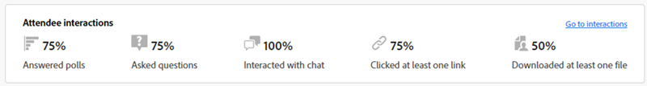

# Tableau de bord des engagements {#engagement-dashboard}

Les webinaires interactifs optimisés par Adobe Connect utilisent divers pods pour impliquer les participants dans le chat, les questions et réponses, les quiz et les sondages. Le tableau de bord de l’engagement vous permet de suivre les mesures clés et les visualisations de données.

Affichez une vue consolidée des activités, interactions et engagements des participants au cours d’un événement. En tant qu’hôte, vous pouvez afficher les performances des événements en direct et à la demande et télécharger divers rapports après la session. En outre, les rapports post-webinaire générés à partir du tableau de bord sont utilisés pour évaluer l’efficacité de la session, informer le contenu futur et améliorer la stratégie globale du webinaire.

Le tableau de bord effectue le suivi de diverses mesures, notamment les réponses aux sondages, l’activité de conversation et les interactions vidéo, ce qui offre des informations précieuses sur les préférences et les comportements des participants. Il offre un aperçu complet des niveaux d’activité et d’engagement des participants, ce qui permet aux hôtes de surveiller l’assiduité, la participation et les interactions en temps réel.

Affichez l’engagement pour les types de sessions suivants dans un webinaire interactif.

* **Session en direct** : session en ligne en temps réel au cours de laquelle les participants peuvent interagir activement.
* **Session à la demande** : l’enregistrement de l’événement en direct est disponible en tant qu’événement à lui seul. Les nouveaux invités peuvent s’inscrire et regarder l’enregistrement. Après l&#39;inscription, ils recevront un lien de jonction à l&#39;événement, qui les mènera à l&#39;enregistrement de l&#39;événement après sa fin. Les participants inscrits à l’événement en direct peuvent également visionner l’enregistrement en utilisant le même lien de jonction.

## Afficher le tableau de bord {#view-the-dashboard}

1. Accédez à **[!UICONTROL Activités marketing]**.

   

1. Sélectionnez l’événement terminé souhaité.

   

1. Dans la présentation, cliquez sur **[!UICONTROL Afficher le tableau de bord de l’engagement]**.

   

   >[!NOTE]
   >
   >Le tableau de bord de l’engagement est accessible 45 à 120 minutes après la fin de l’événement planifié.

## Détails du tableau de bord {#dashboard-details}

Vous pouvez afficher les détails suivants dans le tableau de bord de l’engagement.

<table><tbody>
  <tr>
    <td><b>Résumé des événements</td>
    <td>Fournit une vue consolidée des performances des sessions en direct et à la demande.</td>
  </tr>
  <tr>
    <td><b>Engagement</td>
    <td>Fournit un aperçu des performances des sessions en direct.</td>
  </tr>
  <tr>
    <td><b>Interactions</td>
    <td>Fournit une vue détaillée de l'engagement des participants sur l'ensemble des capsules.</td>
  </tr>
  <tr>
    <td><b>Activité à la demande</td>
    <td>Fournit un résumé des performances d’enregistrement.</td>
  </tr>
  <tr>
    <td><b>Activité du participant</td>
    <td>Fournit une vue consolidée de l’engagement.</td>
  </tr>
  <tr>
    <td><b>Téléchargement de rapports</td>
    <td>Téléchargez les rapports d’engagement dans différents pods.</td>
  </tr>
</tbody>
</table>

### Résumé des événements {#event-summary}

Cette interface fournit une vue consolidée des performances de l’événement pour les sessions en direct et à la demande. Dans le panneau de gauche, sélectionnez Résumé des événements pour afficher les mesures globales.

<table><tbody>
  <tr>
    <td><b>Total des inscriptions</td>
    <td>Il indique le nombre de participants qui se sont inscrits à l’événement.</td>
  </tr>
  <tr>
    <td><b>Nombre total de participants</td>
    <td>Ceci montre le nombre de participants qui ont assisté à l'événement.</td>
  </tr>
  <tr>
    <td><b>Taux de conversion de l’inscription au participant</td>
    <td>Cela indique le pourcentage de participants qui se sont inscrits et qui ont assisté à l’événement.</td>
  </tr>
  <tr>
    <td><b>Les visionneuses ont participé en direct et à la demande</td>
    <td>Il indique le nombre de participants qui ont assisté à des événements en direct et à la demande.</td>
  </tr>
</tbody>
</table>

### Engagement {#engagement}

Fournit un aperçu des performances de la session active d’un événement. La présentation comprend des mesures clés, l’engagement au fil du temps et les interactions des participants. Il aide les organisateurs à évaluer le succès de l&#39;événement et à identifier les domaines à améliorer.

Dans le panneau de gauche, sélectionnez **[!UICONTROL Engagement]** pour afficher les performances de la session en direct. **[!UICONTROL Cliquez sur Résumé de l’engagement (PDF)]** pour télécharger le résumé des performances de la session active. La présentation fournit des données dans différentes sections.

**Mesures clés**

Affichez le nombre d’inscriptions, de participants et d’engagements dans la session active.

<table><tbody>
  <tr>
    <td><b>Inscriptions</td>
    <td>Affichez le nombre d’enregistrements pour la session active.</td>
  </tr>
  <tr>
    <td><b>Participants</td>
    <td>Affichez le nombre de participants présents à la session en direct.</td>
  </tr>
  <tr>
    <td><b>Très engagé</td>
    <td>Affichez le nombre de participants qui se sont montrés très engagés au cours de la session en direct et qui sont susceptibles d’être les meilleurs prospects.</td>
  </tr>
  <tr>
    <td><b>Modérément engagé</td>
    <td>Affichez le nombre de participants modérément engagés pendant la session en direct.
     <b>Remarque </b> : ces nombres sont calculés en fonction de l’engagement et des interactions au cours de la session.</td>
  </tr>
  <tr>
    <td><b>Durée moyenne de surveillance en minutes</td>
    <td>Affiche la durée moyenne de surveillance, en minutes, de la session active.</td>
  </tr>
</tbody>
</table>

**Engagement dans le temps**

Découvrez l’engagement moyen au fil du temps pendant la session en direct à partir des graphiques d’engagement. Les hôtes peuvent surveiller les fluctuations des niveaux d’engagement, ce qui leur permet d’identifier les moments critiques d’interaction élevée ou faible. Découvrez dans quelle mesure le score d’engagement moyen a été gagné par les participants engagés dans différentes dispositions.

Pointez sur le graphique pour afficher les informations suivantes :

* Heure à laquelle le niveau d’engagement est surveillé.
* Score d’engagement moyen à ce moment.
* Nombre de participants engagés à ce moment.
* Mise en page de l’engagement à ce moment-là.
* Sélectionnez **[!UICONTROL Afficher l’instant dans l’enregistrement]** pour afficher l’instant dans lequel l’engagement a été élevé ou faible.
* Score d’engagement moyen (%) au fil du temps dans la session
* Assiduité au fil du temps pendant la session
* L’engagement dans différentes dispositions de webinaire s’affiche lorsque différentes dispositions ont été utilisées dans la salle pendant l’événement. Cela permet de corréler l’augmentation et la diminution de l’engagement dans différentes dispositions.

**Interactions avec les participants**

Vous pouvez afficher les interactions des participants depuis différents pods. Il fournit des informations telles que les réponses aux sondages, les questions posées, l’interaction avec le chat, le clic sur au moins un lien et le téléchargement d’au moins un fichier.

Sélectionnez **[!UICONTROL Accéder aux interactions]** pour afficher les réponses des sondages, les mesures de QnA et les réactions des participants au cours de la session. Affichez la manière dont les participants sont engagés entre les capsules à partir d’Interactions et téléchargez les rapports d’interaction à partir de la section ci-dessous.

### Interactions {#interactions}

Découvrez comment les participants interagissent et participent à la session à partir d’Interactions. Suivez les réponses aux sondages, les mesures QnA, les réactions des participants et les liens et fichiers ignorés des capsules respectives. Les hôtes peuvent également télécharger les rapports d’interaction de ces capsules pour une meilleure analyse. En analysant ces interactions, vous pouvez identifier les tendances et ajuster leurs stratégies afin d’encourager un environnement plus interactif et plus attrayant.

Dans le panneau de gauche, sélectionnez **[!UICONTROL Interactions]** pour afficher la manière dont les participants sont engagés entre les capsules.

Sélectionnez l’onglet **[!UICONTROL Sondages]** dans la barre de menus pour afficher les questions et les réponses ajoutées au sondage. Cet onglet affiche les informations suivantes :

* Sélectionnez **[!UICONTROL Rapport d’interrogation (CSV)]** pour télécharger le rapport concernant les interactions dans la capsule d’interrogation.
* Question de sondage et son type.
* Nombre de réponses et période pendant laquelle la capsule de sondage a été ouverte et engagée.
* Sélectionnez **Afficher toutes `<number>` réponses** pour les afficher dans une boîte de dialogue.

Sélectionnez l’onglet **[!UICONTROL Autres interactions]** dans la barre de menus pour afficher l’engagement dans d’autres capsules et télécharger leurs rapports.

Sélectionnez **[!UICONTROL Télécharger des rapports d’interaction]** dans la liste déroulante pour télécharger les rapports de différents pods. Téléchargez le rapport QnA, le rapport Liens et fichiers et le rapport Réactions à partir d’ici pour un meilleur suivi.

Les informations d’engagement sur les capsules sont disponibles dans différentes sections.

**Mesures QnA**

Affichez les attributs suivants de la capsule de questions/réponses.

* Nombre total de questions posées.
* Nombre de questions sans réponse.
* Nombre de participants qui ont posé des questions.
* Nombre de participants qui ont posé plusieurs questions et qui sont susceptibles d&#39;être les meilleurs prospects.
* Temps moyen nécessaire pour répondre à une question.

**Réactions**

Affichez les réactions des participants à partir d’ici, telles que l’accord, le désaccord, les applaudissements et les rires pendant la session.

Dans le graphique des réactions, affichez les détails suivants :

* Total des réactions
* Nombre de participants ayant réagi au moins une fois
* Nombre total de clics
* Participants uniques
* Tendance des clics sur les réactions en fonction du nombre total de clics concernant les participants uniques.

**Capsule Weblinks**

Afficher les liens ajoutés au pod de liens web au cours de la session et le nombre de clics sur le lien partagé. Le pod Weblinks vous permet d’ajouter des liens provenant de sources extérieures au webinaire pour générer de l’engagement.

Dans le graphique, affichez les détails suivants :

* Liens ajoutés au pod de liens web.
* Nombre de participants ayant cliqué sur au moins un lien.
* Nombre de liens lancés par l’hôte.
* Tendance des clics uniques sur chaque lien ajouté au pod de liens web.

**Module de fichiers**

Affichez les fichiers ajoutés au pod de fichiers au cours de la session et le nombre de téléchargements uniques. Le pod de fichiers vous permet d’ajouter des fichiers et de fournir des ressources pour générer l’engagement.

Dans le graphique, affichez les détails suivants :

* Nom des fichiers ajoutés au pod de fichiers.
* Nombre de participants ayant téléchargé au moins un fichier.
* Tendance des téléchargements uniques sur chaque fichier ajouté au pod de liens web.

### Activité à la demande {#on-demand-activity}

Dans le panneau de gauche, sélectionnez **[!UICONTROL Activité à la demande]** pour afficher le résumé des enregistrements. Vous pouvez également télécharger un rapport pour les activités à la demande.

Dans l’activité à la demande, affichez les mesures suivantes :

* Cliquez sur **[!UICONTROL Rapport à la demande (CSV)]** pour télécharger les mesures à la demande.
* Nombre de visionneuses uniques avant la dernière actualisation du tableau de bord.
* Nombre de spectateurs qui ont visionné l’enregistrement mais qui n’ont pas pu assister au webinaire.
* Nombre de spectateurs ayant assisté au webinaire et visionné l’enregistrement. Il est probable qu’ils fassent partie des meilleurs prospects.
* Nombre de visionneuses qui se sont inscrites à la session à la demande.
* Durée moyenne de visionnage de l’enregistrement en minutes.

### Activité du participant {#participant-activity}

Dans le panneau de gauche, sélectionnez **[!UICONTROL Activité du participant]** pour afficher des informations consolidées sur le niveau d’engagement de chaque participant. Découvrez comment cet engagement est classé par niveaux à partir du niveau d’engagement du participant. Cliquez sur **[!UICONTROL Rapport d’activité de l’utilisateur (CSV)]** pour télécharger le rapport afin d’améliorer le suivi.

Affichez les détails suivants à partir du tableau :

* Niveau d’engagement de chaque participant. Vous pouvez également les trier de haut en bas ou inversement.
* Durée de la session à laquelle a participé le participant.
* Sondages auxquels le participant a répondu.
* Fichiers téléchargés par le participant à partir du pod de fichiers.
* Liens sur lesquels le participant a cliqué dans la capsule des liens web.
* Questions posées par le participant de la capsule QnA.

### Téléchargement de rapports {#download-reports}

Téléchargez des rapports pour différentes activités et capsules à partir d’un hub centralisé en tant qu’hôte.

1. Dans le panneau de gauche, sélectionnez **[!UICONTROL Télécharger les rapports]**.

1. Sélectionnez **[!UICONTROL Télécharger tout (.zip)]** pour télécharger simultanément les rapports de toutes les activités et tous les pods.

   

>[!NOTE]
>
>Cliquez sur l’icône de téléchargement en regard de chaque rapport pour les télécharger individuellement.

## Niveau d’engagement du participant {#participant-engagement-level}

Les entreprises utilisent Adobe Connect pour proposer des webinaires hautement personnalisés, axés sur la marque et l’engagement. Les outils interactifs tels que les sondages, les discussions, les questions/réponses et les réactions permettent d’impliquer les participants et de collecter bien plus que de simples données d’inscription et de présence. Une fois que les participants ont utilisé ces fonctionnalités interactives, les données d’engagement sont utilisées pour classer les participants en trois niveaux d’engagement : élevé, moyen et faible. Vous pouvez utiliser le niveau d’engagement pour mettre à jour les segments d’audience, les scores de personne et alerter les ventes.

Comprenez les critères de classification du niveau d’engagement de chaque participant :

<table><thead>
  <tr>
    <th>Niveau d’engagement</th>
    <th>Critères de classification</th>
  </tr></thead>
<tbody>
  <tr>
    <td>Élevé</td>
    <td>Participants répondant à tous les critères suivants :
    <li>La durée de participation est d'au moins 80 % de la durée totale de l'événement.</li>
    <li>Toutes les questions à choix multiples (MCQ) et les sondages à réponses multiples (MA) ont obtenu une réponse, au moins un fichier est téléchargé, ou le nombre de conversations publiées est de cinq ou plus.</li>
    <li>Le participant a posé au moins une question dans la capsule Q&amp;R.</li></td>
  </tr>
  <tr>
    <td>Support</td>
    <td>Participants répondant à tous les critères suivants :
    <li>Le niveau d'engagement de l'participant n'est pas considéré comme élevé.</li>
    <li>La durée de participation est d'au moins 60 % de la durée totale de l'événement.</li>
    <li>Au moins une des actions suivantes a été effectuée par le participant :
    <ul>
    <li>A répondu à au moins un sondage.
    <li>A posé au moins une question dans la capsule Q&amp;R.<li>A téléchargé au moins un fichier.
    <li>A cliqué (mais pas lancé) sur au moins un lien web.<li>Vous avez posté trois ou plus de conversations.</ul></li>
    </td>
  </tr>
  <tr>
    <td>Faible</td>
    <td>Tous les participants n'ont pas été classés comme étant de niveau élevé ou moyen.</td>
  </tr>
</tbody></table>
