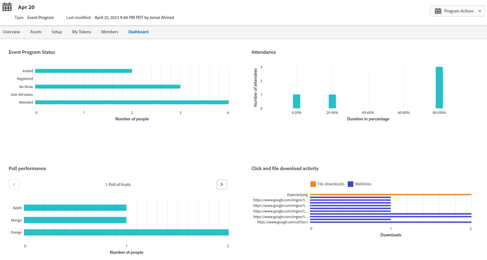

# Workflows des événements {#event-workflows}

Une fois le webinaire terminé, accédez à l’onglet Tableau de bord pour afficher les performances agrégées.

>[!NOTE]
>
>Si le webinaire n&#39;a pas été terminé ou que les données n&#39;ont pas été reçues pour une raison quelconque, l&#39;onglet Tableau de bord ne sera pas encore disponible.

## Synchronisation manuelle {#manual-sync}

Les webinaires interactifs vous permettent d’obtenir les données d’engagement de votre webinaire auprès d’Adobe Connect si vous ne les avez pas reçues automatiquement dans les deux heures suivant la fin du webinaire. Un bouton &quot;Synchroniser maintenant&quot; s’affiche dans la page Aperçu. Cliquer sur **Synchroniser maintenant** déclenche une extraction d’Adobe Connect pour renseigner les données dans Marketo Engage. Une fois la synchronisation effectuée, le bouton disparaît et l’onglet Tableau de bord devient renseigné.

## Widgets de tableau de bord {#dashboard-widgets}

Le tableau de bord se compose de quatre widgets.

**Event Program Status** : indique les différents états du programme pour cet événement et le nombre de membres du programme qui détiennent actuellement cette valeur.

**Participation** : présente la durée de participation des différents membres ayant participé au webinaire par rapport à la durée totale du webinaire en termes de pourcentage.

**Performance du sondage** : affiche divers sondages lancés lors du webinaire optimisé par Adobe Connect et la distribution des membres ayant participé au sondage et y ayant répondu pour chacune des réponses.

**Activité de téléchargement de fichiers et de clics** : fournit le nombre de téléchargements de fichiers et de liens Web sur lesquels l’utilisateur a cliqué au cours du webinaire optimisé par Adobe Connect par divers membres qui ont assisté au webinaire et pris cette mesure spécifique.

## Enregistrement de webinaire {#webinar-recording}

Accédez à l’onglet Aperçu pour afficher le webinaire enregistré, obtenir le lien pour le partager et même télécharger une copie.

>[!NOTE]
>
>* Les webinaires interactifs ne sont pas enregistrés automatiquement. Une fois le webinaire lancé, cliquez sur la liste déroulante en regard du nom du webinaire et sélectionnez **Enregistrer la session**.
>* Si la session est enregistrée, l’hôte doit mettre fin manuellement à l’enregistrement ou sélectionner &quot;Terminer la session pour tous&quot; pour arrêter l’enregistrement. Sinon, l&#39;enregistrement s&#39;arrêtera automatiquement dans les 10 minutes suivant le dernier participant qui quittera la pièce.
>* L’enregistrement est téléchargé au format MP4.
>* Lorsque vous partagez l’enregistrement, toute personne disposant du lien peut le voir. Assurez-vous donc qu’il est partagé avec l’audience prévue.

## Déclencheurs et filtres {#triggers-and-filters}

Utilisez les déclencheurs et filtres liés au webinaire interactif pour localiser des groupes de personnes spécifiques dans votre programme d’événements.

Chaque déclencheur/filtre est associé à des contraintes supplémentaires, ce qui vous permet de capturer un sous-ensemble ciblé de ce groupe.

**Pose des questions pendant l’événement** (Version du filtre : a posé des questions pendant l’événement)

**Participer à l’événement** (Version du filtre : a assisté à l’événement)

**Clics sur un lien** (Version du filtre : clic sur un lien)

**Télécharge une ressource** (Version du filtre : téléchargement d’une ressource)

**Répond à un sondage** (Version du filtre : réponse à un sondage)

