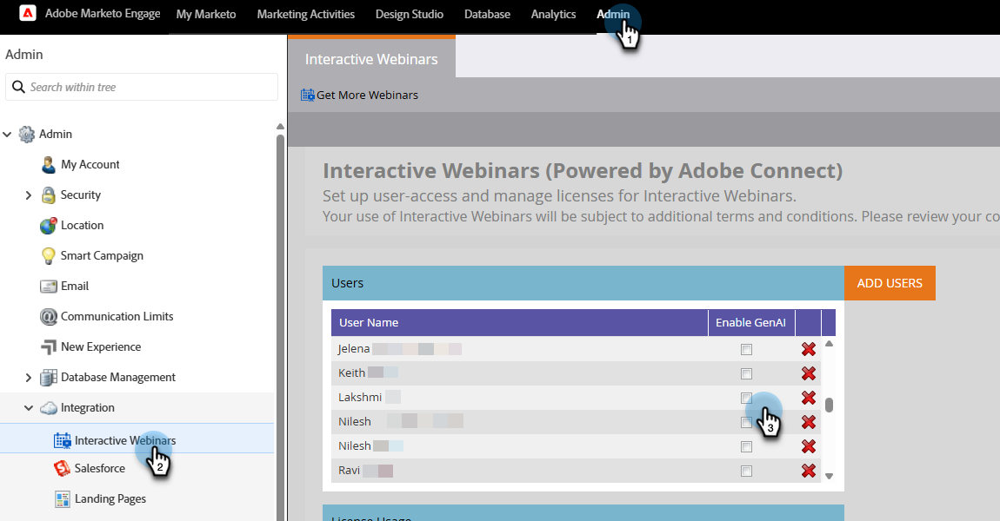

# Fonctionnalités de GenAI {#gen-ai-features}

Générez automatiquement des chapitres et des résumés pour vos webinaires enregistrés, ce qui les rend plus accessibles et plus faciles à parcourir pour votre audience.

* **Génération automatique de chapitres** : la technologie optimisée par l’IA crée des chapitres pour le contenu de votre webinaire.

* **Résumé généré par l’IA** : obtenez un résumé textuel automatisé de votre webinaire.

* **Contenu modifiable** : modifiez les chapitres et les résumés générés si vous le souhaitez, à l’aide des fonctionnalités de modification manuelle et optimisée par l’IA.

* **Intégration facile** : ajoutez facilement des chapitres et des résumés à vos pages de destination en copiant le code HTML dans l’éditeur de page web de votre choix.

## Activer GenAI {#enable-genai}

>[!PREREQUISITES]
>
>Avant d’utiliser ces fonctionnalités, vous devez d’abord accepter les conditions générales d’Adobe GenAI. Si vous ne l’avez pas encore fait, contactez l’équipe chargée de votre compte Adobe (votre gestionnaire de compte) pour plus d’informations.

Après avoir accepté les conditions générales d’Adobe GenAI, l’étape suivante consiste à les activer pour les utilisateurs individuels. Pour ce faire, accédez à **[!UICONTROL Admin]** > **[!UICONTROL Webinaires interactifs]** et sélectionnez les utilisateurs qui doivent avoir accès à GenAI.

{width="800" zoomable="yes"}

## Accès {#how-to-access}

1. Accédez à la page d’aperçu du webinaire dans les webinaires interactifs Marketo Engage.

1. Après avoir organisé votre webinaire à la demande, attendez 30 à 60 minutes que l’IA traite votre enregistrement. Vous pourrez cliquer sur le bouton Générer lorsqu’il sera disponible.

1. Cliquez sur **[!UICONTROL Afficher le contenu GenAI]**.

   {width="800" zoomable="yes"}

1. Un nouvel onglet s’ouvre, affichant des chapitres générés par l’IA et un résumé textuel.

## Modifier le contenu généré {#edit-generated-content}

1. Consultez les chapitres et le résumé générés.

1. Si des modifications sont nécessaires, cliquez sur le bouton **[!UICONTROL Modifier]**.

   Apporter des modifications :

   * Modifiez le texte dans le résumé et/ou les titres des chapitres.

   * Ajustez les horodatages si nécessaire en modifiant les valeurs dans les champs d’horodatage.

   * Supprimez les chapitres indésirables en les sélectionnant et en cliquant sur **[!UICONTROL Supprimer]**.

   * Fusionnez deux chapitres consécutifs en les sélectionnant et en cliquant sur **[!UICONTROL Fusionner]**.

      * AI génère un chapitre composite composé des deux chapitres sélectionnés

      * Pour fusionner plusieurs chapitres, vous devez en faire deux à la fois

     {width="800" zoomable="yes"}

   >[!NOTE]
   >
   >* Si vous le souhaitez, vous pouvez évaluer la qualité des chapitres/résumés générés à l’aide des icônes _pouces vers le haut_  ou _pouces vers le bas_ . Vous pouvez également signaler tout contenu problématique en cliquant sur l’icône d’indicateur .
   >
   >* Si le résumé initial ne vous convient pas, vous pouvez cliquer sur le bouton **[!UICONTROL Régénérer le résumé]** pour générer une autre version.

1. Enregistrez vos modifications en cliquant sur le bouton **[!UICONTROL Enregistrer]** en haut à droite de l’écran.

## Utiliser le contenu généré {#use-generated-content}

Après avoir copié le contenu que vous souhaitez utiliser, collez-le dans l’éditeur de votre choix (par exemple, l’éditeur de la page de destination de Marketo Engage) et apportez les modifications souhaitées.

### Résumé {#summary}

**Copier HTML** - Cliquez sur le bouton **[!UICONTROL Copier HTML]** pour obtenir l’intégralité du texte, avec le code HTML le formatant dans un tableau.

**Texte uniquement** - Si vous souhaitez uniquement le texte, mettez-le simplement en surbrillance et sélectionnez Ctrl/Cmd+C (ou cliquez avec le bouton droit) pour le copier.

### Chapitres {#chapters}

**Copier HTML** - Cliquez sur le bouton **[!UICONTROL Copier HTML]** pour mettre en forme l’ensemble de l’enregistrement et ses chapitres dans un lecteur vidéo.

## Cibler votre audience

Utilisez les filtres et/ou triggers de campagnes/listes intelligentes pour voir ce que chaque visionneuse a regardé, combien de fois, etc., afin d’obtenir des suivis personnalisés.

{width="800" zoomable="yes"}

* **Déclencheurs** : _clics sur le lien d’une page web_, _page web des visites_

* **Filtres** : _lien cliqué sur une page web_, _page web visitée_

Le « lien » est le nom du chapitre et la « page web » est la page qui héberge votre webinaire à la demande.

>[!TIP]
>
>Utilisez des [contraintes](/help/marketo/product-docs/core-marketo-concepts/smart-lists-and-static-lists/using-smart-lists/add-a-constraint-to-a-smart-list-filter.md){target="_blank"} pour affiner davantage votre audience cible.

## Éléments à noter {#things-to-note}

* La suppression ou la fusion de chapitres affecte uniquement la pile de chapitres, et non le contenu vidéo lui-même. Ces actions sont permanentes.

* Les fonctionnalités de GenAI sont flexibles et peuvent être utilisées avec divers éditeurs de page web, pas seulement ceux de Marketo Engage.

* Prévisualisez toujours vos modifications pour vous assurer de bénéficier des fonctionnalités et de l’apparence souhaitées.

* La suppression du webinaire entraîne également la suppression du contenu GenAI.

* Si vous souhaitez supprimer le contenu GenAI sans supprimer le webinaire, contactez l’équipe du compte Adobe (votre gestionnaire de compte) ou envoyez une demande de suppression de données à : `marketo-webinar-genai-alerts@adobe.com`.
