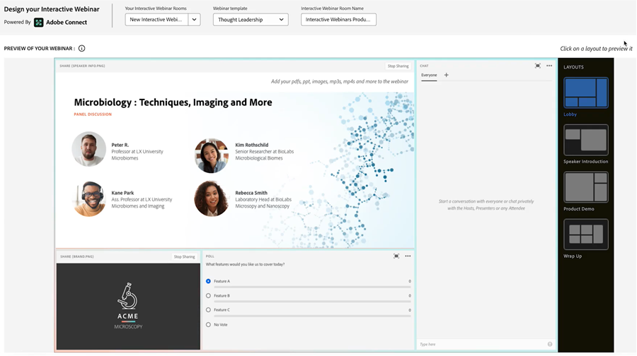

# Prise en main des webinaires interactifs {#get-started-with-interactive-webinars}

Vous avez donc lu la [ Présentation des webinaires interactifs ](/help/marketo/product-docs/demand-generation/events/interactive-webinars/interactive-webinars-overview.md){target="_blank"}{target="_blank"} et êtes prêt à vous lancer. Suivez les étapes ci-dessous pour commencer.

## Que faire {#what-to-do}

**Étape 1** : [Ajouter des utilisateurs](/help/marketo/product-docs/demand-generation/events/interactive-webinars/user-and-license-management.md#add-a-user){target="_blank"} — Découvrez comment ajouter (et supprimer ultérieurement, si vous le souhaitez) des utilisateurs pour l’accès aux webinaires interactifs.

**Étape 2** : [créer un webinaire interactif](/help/marketo/product-docs/demand-generation/events/interactive-webinars/create-an-interactive-webinar.md){target="_blank"}{target="_blank"} — Découvrez comment créer un programme d’événement et définir les paramètres initiaux de votre webinaire.

**Étape 3 (facultatif)** : [Ajoutez une équipe de webinaires](/help/marketo/product-docs/demand-generation/events/interactive-webinars/add-a-webinar-team.md){target="_blank"}{target="_blank"} — Si vous ne prévoyez pas d’organiser le webinaire vous-même, apprenez à ajouter des présentateurs et des co-animateurs pour partager les tâches d’hébergement et de présentation.

**Étape quatre** : [Concevoir votre webinaire interactif](/help/marketo/product-docs/demand-generation/events/interactive-webinars/designing-interactive-webinars.md){target="_blank"} — Une fois le webinaire créé et une équipe facultative ajoutée, il est temps d’adapter l’événement en fonction de vos besoins.

**Étape 5** : [Promouvoir votre webinaire](/help/marketo/product-docs/demand-generation/events/interactive-webinars/promoting-an-interactive-webinar.md){target="_blank"} — Découvrez de précieux conseils sur la façon de promouvoir votre événement à venir.

**Étape 6** : [Diffuser votre webinaire interactif](/help/marketo/product-docs/demand-generation/events/interactive-webinars/deliver-an-interactive-webinar.md){target="_blank"} - Tout ce que vous devez savoir sur la présentation de votre webinaire.

C&#39;est ça !

## Documentation supplémentaire {#additional-documentation}

Une fois votre webinaire terminé, découvrez ses performances à l’aide du tableau de bord utile dans l’écran Aperçu de l’événement. L’engagement détaillé de votre audience est visible dans le [tableau de bord d’engagement](/help/marketo/product-docs/demand-generation/events/interactive-webinars/engagement-dashboard.md){target="_blank"}. Tirez parti de l’engagement du webinaire pour cibler l’audience de manière personnalisée à l’aide de filtres intelligents et de triggers dans les [workflows d’événement](/help/marketo/product-docs/demand-generation/events/interactive-webinars/event-workflows.md){target="_blank"}. Et apprenez à suivre vos performances à la demande grâce aux [webinaires à la demande](/help/marketo/product-docs/demand-generation/events/interactive-webinars/on-demand-webinars.md){target="_blank"}.

Nous disposons d’autres articles d’aide sur ce sujet, notamment [Bonnes pratiques pour les webinaires interactifs](/help/marketo/product-docs/demand-generation/events/interactive-webinars/best-practices-for-interactive-webinars.md){target="_blank"}, comment [personnaliser vos webinaires](/help/marketo/product-docs/demand-generation/events/interactive-webinars/customization.md){target="_blank"} pour refléter vos besoins/votre image de marque, créer des modèles à l’échelle de l’organisation en utilisant [Modèles pour les webinaires interactifs](/help/marketo/product-docs/demand-generation/events/interactive-webinars/templates.md){target="_blank"} et comment gérer les salles et les enregistrements dans [Gestion des salles](/help/marketo/product-docs/demand-generation/events/interactive-webinars/room-management.md){target="_blank"}.

 

Profitez des webinaires interactifs (optimisés par Adobe Connect) !
