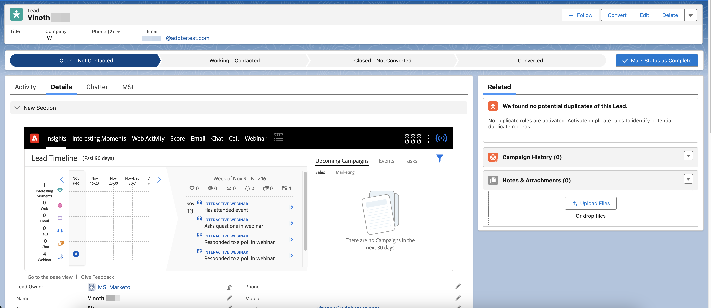

# Webinaires interactifs dans Informations sur les ventes Marketo {#interactive-webinars-in-marketo-sales-insight}

Webinaires interactifs dans Marketo Sales Insight rend les activités de vos webinaires disponibles dans le plug-in Marketo Sales Insight (MSI) de Salesforce.

>[!PREREQUISITES]
>
>Cette fonctionnalité est uniquement prise en charge pour ceux qui ont acheté le module complémentaire Marketo Sales Insight[&#128279;](https://business.adobe.com/fr/products/marketo/sales-intelligence-engagement.html).

Une fois les activités enregistrées dans Marketo Engage (une fois le webinaire terminé dans Adobe Connect), elles sont synchronisées en temps réel vers Salesforce via le plug-in MSI.

Chaque activité rendue disponible dans Marketo Engage est synchronisée. Ces activités sont les suivantes :

* Participe à un événement
* Répond à une enquête
* Répond à une question
* Clique sur un lien
* Télécharge une ressource

Tous les attributs pertinents de ces activités sont également mis à la disposition du vendeur pour qu’il les examine et prenne des mesures concernant les prospects individuels. Les informations sur les activités sont disponibles dans la section Insights générique ainsi que dans un onglet séparé du webinaire.

Dans la section Insights , le graphique Chronologie des leads contient un autre volet pour les webinaires qui mettent en évidence les activités synchronisées pendant les 90 derniers jours pour chaque semaine. Lors de la sélection d’une semaine particulière, les activités sont affichées par jour dans une section distincte. Vous pouvez développer des activités individuelles pour afficher leurs détails.

{width="800" zoomable="yes"}

Dans l’onglet Séparé du webinaire, toutes les activités (et leurs dates) sont également répertoriées sous la forme d’un tableau.

{width="800" zoomable="yes"}
