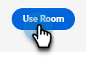

# Modification ou suppression d’un webinaire interactif {#modify-or-delete-an-interactive-webinar}

Découvrez comment apporter des modifications à votre webinaire interactif.

## Modification d’un webinaire interactif {#modify-an-interactive-webinar}

1. Sélectionnez le programme Événement de votre choix et cliquez sur **Changer de chambre/modèle**.

   

1. La pièce va charger. Si vous souhaitez modifier la pièce, sélectionnez-en une dans la liste déroulante Chambres . Pour simplement mettre à jour votre modèle, cliquez sur **Utiliser la salle**.

   

>[!NOTE]
>
>La modification de votre chambre est facultative et n’est pas nécessaire pour mettre à jour votre modèle.

1. Cliquez sur **Affiner votre webinaire maintenant**.

   

1. Sélectionnez vos préférences audio/vidéo et cliquez sur **Entrée dans la salle**.

   

1. Une fois les modifications effectuées, cliquez sur **Quitter la salle**.

   

## Replanification d’un webinaire interactif {#reschedule-an-interactive-webinar}

1. Sélectionnez le programme d’événements de votre choix et cliquez sur l’icône en forme de crayon en regard de la date/l’heure actuellement planifiée.

   

1. Cliquez sur l’icône du calendrier, choisissez la nouvelle date/heure, puis cliquez sur **Enregistrer**.

   

## Clonage d’un webinaire interactif {#clone-an-interactive-webinar}

1. Sélectionnez le programme d’événements de votre choix.

   

1. Cliquez sur la liste déroulante Actions de programme et sélectionnez **Cloner**.

   

   >[!TIP]
   >
   >Vous pouvez également cliquer avec le bouton droit sur le programme d’événements dans l’arborescence et sélectionner **Clone** dans l’arborescence.

1. Donnez un nom au programme cloné, définissez Workspace et Destination (si vous souhaitez que le programme vive ailleurs), puis cliquez sur **Enregistrer**.

   

1. Cliquez sur **Suivant**.

   

   >[!NOTE]
   >
   >Actuellement, vous ne pouvez enregistrer un webinaire interactif cloné qu’en tant que webinaire interactif. Enregistrement d’un webinaire cloné comme webinaire partenaire (par exemple, Zoom, ON24, etc.) sera bientôt disponible.

1. Choisissez les paramètres de votre webinaire cloné et cliquez sur **Cloner**.

   

## Suppression d’un webinaire interactif {#delete-an-interactive-webinar}

1. Sélectionnez le programme d’événements de votre choix.

   

1. Cliquez sur la liste déroulante Actions de programme et sélectionnez **Supprimer**.

   

   >[!TIP]
   >
   >Vous pouvez également cliquer avec le bouton droit sur le programme d’événements dans l’arborescence et sélectionner **Supprimer** dans l’arborescence.

1. Cliquez sur **Supprimer**.

   

   >[!IMPORTANT]
   >
   >S’il existe des ressources locales dans le programme, elles seront également supprimées.
