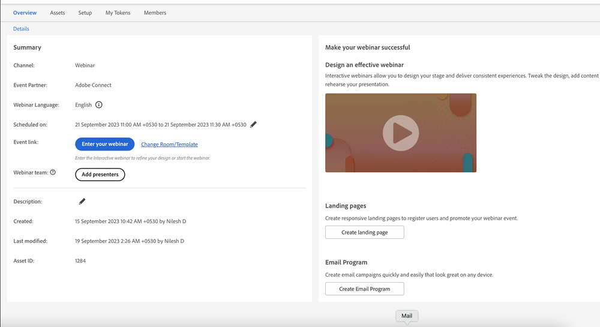

# Promotion d’un webinaire interactif {#promoting-an-interactive-webinar}

La promotion d’un webinaire interactif est similaire à la promotion d’un webinaire partenaire via Launchpoint. Lors de la création d’un programme d’événement de webinaire interactif, vous pouvez ajouter des membres à un programme en exécutant une campagne ou en important des membres dans le programme. Pour vérifier les membres qui ont été ajoutés au programme d’événements de webinaires interactifs, cliquez sur l’onglet Membres .

Une fois les membres ajoutés ou importés dans le programme, vous pouvez créer une campagne par e-mail dans le programme d’événement webinaire interactif pour envoyer une invitation à tous les membres du programme et modifier leur statut &quot;invité&quot; une fois le message envoyé.

>[!NOTE]
>
>Si vous souhaitez ajouter un co-hôte ou un présentateur en tant que membre de l’audience au programme d’événement de webinaire interactif, vous devez utiliser un autre ID d’adresse électronique pour celui-ci, sans quoi il recevra une erreur &quot;cet email est déjà enregistré&quot;.

L’email peut contenir des détails spécifiques sur le programme, ainsi qu’une URL de page d’entrée qui redirigerait le destinataire vers une page spécifique où plus d’informations sur le webinaire (contenu, informations sur le présentateur, etc.). peut être ajouté. Cette page d’entrée peut être créée en tant que ressource locale dans le programme d’événements de webinaires interactifs.

Vous pouvez solliciter l’enregistrement pour ce webinaire en activant un formulaire sur la page d’entrée et en liant les clics sur le formulaire à l’enregistrement activé dans le programme d’événement de webinaire interactif. Une campagne peut ensuite être créée en utilisant les envois de formulaire comme déclencheur et en remplaçant l’état du programme &quot;invité&quot; par &quot;enregistré&quot;.

>[!NOTE]
>
>La transition de &quot;invité&quot; à &quot;enregistré&quot; n’est pas automatique dans les webinaires interactifs, car plusieurs déclencheurs peuvent créer la transition.

Une fois qu’un membre a atteint le statut de programme &quot;enregistré&quot; dans un programme d’événement de webinaire interactif, il est automatiquement inscrit au webinaire créé dans Adobe Connect. Les données d’enregistrement telles que le prénom, le nom et l’e-mail sont ensuite transférées vers Adobe Connect. Cela signifie qu’une fois que l’utilisateur rejoint le webinaire en tant que participant, les informations seront disponibles pour le présentateur ou l’hôte pendant le webinaire.

Dans les quelques minutes qui suivent l’enregistrement, l’URL du webinaire du membre est renseignée dans l’onglet Membres . Si vous ne parvenez pas à localiser la colonne pour l’URL du webinaire, vérifiez que la colonne a été ajoutée à votre affichage. Il s’agit d’une URL personnalisée permettant à chaque membre enregistré de participer au webinaire à un moment planifié sans nécessiter d’authentification. Les jetons échangés en interne prennent en charge l&#39;authentification des membres.

Vous pouvez utiliser des jetons pour inclure l’URL du webinaire aux membres individuels d’une campagne par e-mail afin de signaler qu’ils ont été enregistrés dans l’événement et d’utiliser l’URL de jointure pour entrer dans le webinaire à l’heure planifiée. Les jetons de calendrier peuvent être utilisés dans la même campagne par e-mail pour garantir que la planification des webinaires peut être ajoutée aux calendriers des membres.

Des liens sont disponibles sur le côté droit de l’onglet Aperçu de votre programme d’événement pour créer une page d’entrée ainsi qu’une campagne par courrier électronique. Le reste des promotions liées à un événement reste identique aux webinaires des partenaires qui utilisent l’intégration Launchpoint.

Les webinaires interactifs vous permettent de solliciter une inscription avant, pendant ou après un webinaire. Dans tous les cas, il vous suffit de partager l’URL du webinaire avec l’prospect. Un clic sur le lien avant le début du webinaire les envoie à une page d’entrée de pré-webinaire. Un clic dessus pendant le webinaire les conduit au webinaire en cours. Cliquez dessus après le webinaire pour enregistrer le webinaire.
