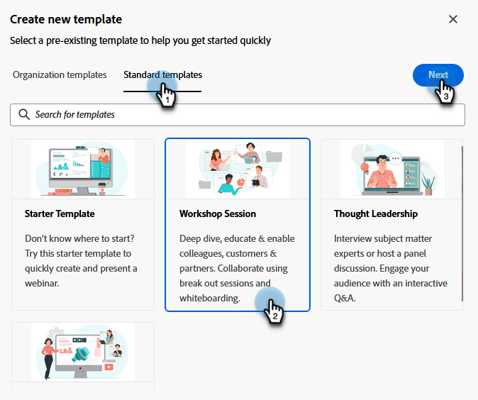
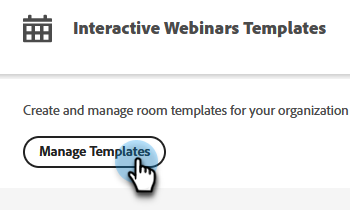
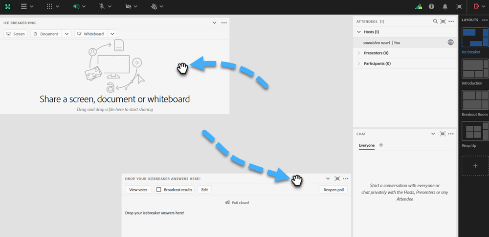

# Modèles de webinaires interactifs {#templates-for-interactive-webinars}

Créez des modèles faciles à utiliser dans les webinaires interactifs pour produire du contenu plus rapidement et respecter les directives de la marque lorsque vous travaillez au sein d’une équipe.

## Octroi des autorisations {#grant-permissions}

Avant que des utilisateurs de votre organisation puissent accéder aux modèles de vos webinaires interactifs, un administrateur Marketo Engage doit d’abord ajouter un accès au(x) rôle(s) souhaité(s).

1. Dans Marketo Engage, cliquez sur **[!UICONTROL Admin]**.

   

1. Cliquez sur **[!UICONTROL Utilisateurs et rôles]**, puis sur l’onglet **[!UICONTROL Rôles]**.

   

1. Double-cliquez sur le rôle auquel vous souhaitez ajouter les autorisations.

   

1. Cliquez pour ouvrir **[!UICONTROL Access Design Studio]**.

   

1. Cochez la case **[!UICONTROL Accéder aux modèles de webinaires interactifs]**.

   

## Création d’un modèle {#create-a-template}

1. Dans Marketo Engage, cliquez sur **[!UICONTROL Design Studio]**.

   

1. Cliquez sur **[!UICONTROL Webinaires interactifs]**.

   

1. Cliquez sur **[!UICONTROL Gérer les modèles]**.

   

1. Un nouvel onglet s’ouvre. Cliquez sur **Créer**.

   

1. Dans l’onglet Modèles standard , sélectionnez le modèle souhaité, puis cliquez sur **Suivant**.

   

   >[!NOTE]
   >
   >Les modèles d’organisation sont les modèles que vous ou votre équipe avez déjà créés.

1. Saisissez un nom et une description. Cliquez sur **Enregistrer et ouvrir**.

   

1. Un nouvel onglet s’ouvre. Pour modifier/enregistrer votre modèle, vous devez entrer une salle. Comme il ne s’agit pas d’une salle de webinaire, il n’est pas nécessaire d’effectuer des sélections audio/vidéo. Cliquez sur **Entrer dans la chambre**.

   

1. Apportez les modifications souhaitées au modèle existant.

   

1. Dans le menu Quitter en haut à droite, sélectionnez **Terminer la session pour tous**.

   

1. Cliquez sur **Terminer maintenant**.

   

Votre modèle est automatiquement enregistré.

## Modification d’un modèle {#edit-a-template}

Pour modifier un modèle existant, procédez comme suit.

1. Dans Marketo Engage, cliquez sur **[!UICONTROL Design Studio]**.

   

1. Cliquez sur **[!UICONTROL Webinaires interactifs]**.

   

1. Cliquez sur **[!UICONTROL Gérer les modèles]**.

   

1. Un nouvel onglet s’ouvre. Recherchez le modèle à modifier et cliquez sur l’icône d’ouverture.

   

1. Un nouvel onglet s’ouvre. Pour modifier votre modèle, vous devez entrer une salle. Comme il ne s’agit pas d’une salle de webinaire, il n’est pas nécessaire d’effectuer des sélections audio/vidéo. Cliquez sur **Entrer dans la chambre**.

   

1. Apportez les modifications souhaitées à votre modèle.

   

1. Dans le menu Quitter en haut à droite, sélectionnez **Terminer la session pour tous**.

   

1. Cliquez sur **Terminer maintenant**.

   

Vos modifications sont automatiquement enregistrées.
