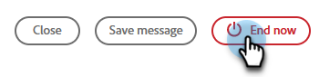

# Modèles de webinaires interactifs {#templates-for-interactive-webinars}

Créez des modèles simples d’utilisation dans des webinaires interactifs afin de produire du contenu plus rapidement et de rester en conformité avec les directives de la marque lorsque vous travaillez en équipe.

## Octroi d’autorisations {#grant-permissions}

Avant que des utilisateurs de votre entreprise puissent accéder aux modèles de vos webinaires interactifs, un administrateur de Marketo Engage doit d’abord ajouter l’accès au ou aux rôles souhaités.

1. Dans Marketo Engage, cliquez sur **[!UICONTROL Admin]**.

   

1. Cliquez sur **[!UICONTROL Utilisateurs et rôles]**, puis sur l’onglet **[!UICONTROL Rôles]**.

   

1. Double-cliquez sur le rôle auquel vous souhaitez ajouter les autorisations.

   

1. Cliquez pour ouvrir **[!UICONTROL Access Design Studio]**.

   

1. Cochez la case **[!UICONTROL Accéder aux modèles de webinaires interactifs]** .

   

## Création d’un modèle {#create-a-template}

1. Dans Marketo Engage, cliquez sur **[!UICONTROL Design Studio]**.

   

1. Cliquez sur **[!UICONTROL Webinars interactifs]**.

   

1. Cliquez sur **[!UICONTROL Gérer les modèles]**.

   

1. Un nouvel onglet s’ouvre. Cliquez sur **Créer**.

   

1. Dans l&#39;onglet Modèles standard , sélectionnez le modèle de votre choix et cliquez sur **Suivant**.

   

   >[!NOTE]
   >
   >Les modèles d’organisation sont les modèles que vous ou votre équipe avez déjà créés.

1. Saisissez un nom et une description. Cliquez sur **Enregistrer et ouvrez**.

   

1. Un nouvel onglet s’ouvre. Pour modifier/enregistrer votre modèle, vous devez entrer dans une pièce. Comme il ne s’agit pas d’une véritable salle de webinaire, il n’est pas nécessaire de faire des sélections audio/vidéo. Cliquez sur **Enter Room**.

   

1. Apportez les modifications souhaitées au modèle existant.

   

1. Dans le menu Quitter en haut à droite, sélectionnez **Terminer la session pour tous les**.

   

1. Cliquez sur **Terminer maintenant**.

   

Votre modèle est automatiquement enregistré.

## Modifier un modèle {#edit-a-template}

Suivez les étapes ci-dessous pour modifier un modèle existant.

1. Dans Marketo Engage, cliquez sur **[!UICONTROL Design Studio]**.

   

1. Cliquez sur **[!UICONTROL Webinars interactifs]**.

   

1. Cliquez sur **[!UICONTROL Gérer les modèles]**.

   

1. Un nouvel onglet s’ouvre. Localisez le modèle à modifier, puis cliquez sur l’icône d’ouverture.

   

1. Un nouvel onglet s’ouvre. Pour éditer votre modèle, vous devez entrer dans une pièce. Comme il ne s’agit pas d’une véritable salle de webinaire, il n’est pas nécessaire de faire des sélections audio/vidéo. Cliquez sur **Enter Room**.

   

1. Apportez les modifications souhaitées à votre modèle.

   

1. Dans le menu Quitter en haut à droite, sélectionnez **Terminer la session pour tous les**.

   

1. Cliquez sur **Terminer maintenant**.

   

Vos modifications sont automatiquement enregistrées.
