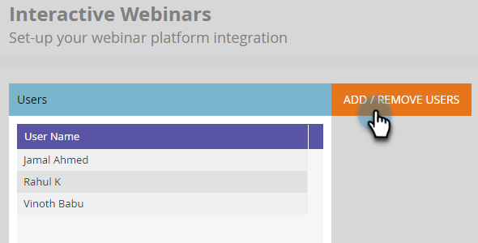

# Gestion des utilisateurs et des licences {#user-and-license-management}

Découvrez comment ajouter et supprimer des utilisateurs et afficher vos licences actuelles.

## Ajout d’un utilisateur {#add-a-user}

1. Accédez au **Administration** zone.

   

1. Cliquez sur **Webinaires interactifs**.

   

1. Cliquez sur **Ajout/suppression d’utilisateurs**.

   

1. Cliquez sur la liste déroulante Utilisateurs disponibles , sélectionnez le ou les utilisateurs que vous souhaitez ajouter, puis cliquez sur **OK**.

   

## Suppression d’un utilisateur {#remove-a-user}

1. Accédez au **Administration** zone.

   

1. Cliquez sur **Webinaires interactifs**.

   

1. Cliquez sur **Ajout/suppression d’utilisateurs**.

   

1. Mettez en surbrillance le ou les utilisateurs que vous souhaitez supprimer, puis appuyez sur la touche Suppr de votre clavier. Cliquez sur **OK** une fois terminé.

   

## Utilisation de la licence {#license-usage}

Les webinaires interactifs offrent des licences spécifiques pour la création d’événements optimisés par Adobe Connect. Chaque fois qu’une licence est ajoutée, une nouvelle boîte d’utilisation de licence s’affiche. Les administrateurs de Marketo peuvent afficher (et non modifier) les licences en suivant les étapes ci-dessous. Contactez l’équipe du compte Adobe (votre gestionnaire de compte) pour obtenir des licences supplémentaires.

1. Accédez au **Administration** zone.

   

1. Cliquez sur **Webinaires interactifs**.

   

1. Faites défiler jusqu’à la ou les cartes d’utilisation de la licence.

   

<table> 
  <tr>
   <td width="20%"><b>Date de début</b></td>
   <td width="80%">Date à laquelle la licence commence.</td>
  </tr>
  <tr> 
   <td width="20%"><b>Date d’expiration</b></td>
   <td width="80%">Date d’expiration de la licence.</td>
  </tr>
  <tr> 
   <td width="20%"><b>Type</b></td>
   <td width="80%">Type de licence achetée. Il existe trois types de licence : Shared Events License, Shared Room License, Additional Storage License.</td>
  </tr>
  <tr> 
   <td width="20%"><b>Capacité de l'événement</b></td>
   <td width="80%">Nombre maximum de participants pouvant être pris en charge dans un événement.</td>
  </tr>
  <tr> 
   <td width="20%"><b>Nombre total d'événements</b></td>
   <td width="80%">Le nombre total d’événements qui ont été configurés avec cette licence.</td>
  </tr>
  <tr> 
   <td width="20%"><b>Événements consommés</b></td>
   <td width="80%">Nombre total d’événements terminés.</td>
  </tr>
  <tr> 
   <td width="20%"><b>Capacité de stockage</b></td>
   <td width="80%">Quantité de stockage disponible pour le stockage des enregistrements, des collatéraux, des heros images, de la documentation et d’autres ressources.</td>
  </tr>
  </tbody>
</table>

**Informations à noter**

* Le type &quot;Licence de stockage supplémentaire&quot; fournit uniquement du stockage, par conséquent la valeur de chaque champ. _besides_ La capacité de stockage sera simplement répertoriée comme &quot;-&quot;.

* Le type &quot;Licence de salle partagée&quot; contient un nombre illimité d’événements et &quot;Licence de stockage supplémentaire&quot; fournit uniquement du stockage. Le champ Total d’événements pour ces licences sera donc simplement répertorié comme &quot;-&quot;.

* Chaque fois qu’un événement est créé, il est compté comme &quot;consommé&quot; à partir de sa licence respective (sauf s’il s’agit d’une licence de salle partagée). La préférence sera accordée à la &quot;Licence d’événement partagé&quot; s’il existe à la fois une &quot;Licence d’événement partagé&quot; et une &quot;Licence d’espace partagé&quot; de la même capacité. Si l’événement n’a pas été diffusé et si le programme d’événements est supprimé avant l’heure planifiée, le nombre d’événements est réapprovisionné en soustrayant un événement des événements consommés.

* Une fois qu’une licence a été épuisée, sa mosaïque reste sur l’écran Webinaires interactifs de la section Admin avec les valeurs &quot;Nombre total d’événements&quot; et &quot;Événements consommés&quot; identiques. Ce n’est que lorsque la licence expire qu’elle sera supprimée de l’écran.

## Accès utilisateur {#user-access}

Les webinaires interactifs permettent de réguler l’utilisation en autorisant les utilisateurs Marketo Engage à créer et à diffuser des webinaires interactifs. Cependant, un utilisateur de webinaire interactif (ou un non-utilisateur) peut toujours disposer d’un accès en lecture/modification aux programmes d’événement de webinaires interactifs créés par d’autres utilisateurs.

Les utilisateurs de Marketo qui ont reçu des autorisations de webinaires interactifs et qui sont propriétaires d’un programme d’événement de webinaires interactifs spécifique pourront exécuter toutes les fonctions de webinaires interactifs liées à ce programme. Cela inclut : création, accès, modification, clonage, déplacement et suppression de ce programme. Cependant, une fois que cet utilisateur n’est plus un utilisateur du webinaire interactif, le propriétaire du programme peut accéder au programme et le déplacer, mais n’effectue aucune autre fonction.

Utilisateurs Marketo qui disposent d’autorisations pour les webinaires interactifs et qui sont _not_ les propriétaires d’un programme d’événement de webinaires interactifs particulier pourront exécuter des fonctions limitées sur ces programmes. Les utilisateurs non-administrateurs de Marketo pourront accéder au programme et le cloner, mais ne pourront pas exécuter d’autres fonctions s’ils disposent des autorisations nécessaires pour les webinaires interactifs. Toutefois, les utilisateurs administrateurs de Marketo _will_ être en mesure d’exécuter toutes les fonctions, telles que l’accès, la modification, le clonage, le déplacement et la suppression de ce programme (tant qu’ils disposent des autorisations nécessaires pour les webinaires interactifs) ; Une fois cette autorisation révoquée pour les utilisateurs administrateurs et non-administrateurs de Marketo, ils ne pourront accéder qu’au programme d’événement de webinaire interactif et ne pourront plus exécuter d’autres fonctions.

La restriction des fonctions exploitables est indiquée par un bouton d’action grisé et un message de survol. Voici quelques exemples des boutons d’action grisés : &quot;Concevoir votre webinaire&quot; ou &quot;Saisir votre webinaire&quot;. Pour les fonctions non exploitables, un message mettant en évidence les restrictions est fourni. Voir l’exemple ci-dessous :

