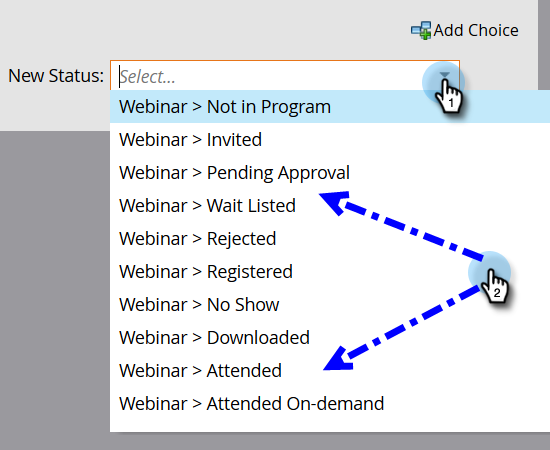
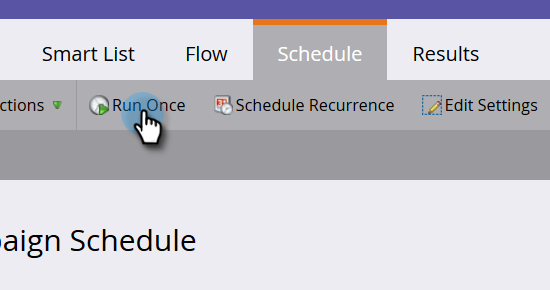

# Ajouter les membres à un Programme de Événement {#adding-members-to-an-event-program}

Cet article ne s&#39;applique qu&#39;aux utilisateurs qui utilisent un cap de Événement ou des objectifs de Événement.

>[!CAUTION]
>
>L&#39;importation directe d&#39;une liste de personnes dans un Programme de Événement empêche ces enregistrements d&#39;être comptabilisés dans les inscriptions réelles dans le rapport Suivi des objectifs et le rapport Progression de la limite de Événement. Suivez les instructions ci-dessous pour vous assurer que vos enregistrements sont comptabilisés.

1. Créez et [ajoutez des personnes à une liste statique](http://docs.marketo.com/x/ecKt).
1. [Créez une campagne](http://docs.marketo.com/x/M4AR) intelligente.
1. Dans la Liste intelligente du Campaign dynamique que vous avez créée à l’étape 2, recherchez et ajoutez le filtre **Membre de Liste**.

   

1. Recherchez et sélectionnez la liste que vous avez créée à l’étape 1.
1. 

1. Dans le flux, recherchez et ajoutez l’étape de flux **Modifier l’état du Programme**.
1. 

1. Recherchez et sélectionnez votre Programme de Événement.

   

1. Sélectionnez l’état de votre choix.

   

1. Dans l’onglet Planification, cliquez sur **Exécuter une fois**.
1. 

1. Sélectionnez **Exécuter maintenant** et cliquez sur **Exécuter**.
1. 

1. Une fois la campagne intelligente exécutée, les membres sont ajoutés au programme et compteront dans le suivi des objectifs et les calculs de progression des limites de Événement.

