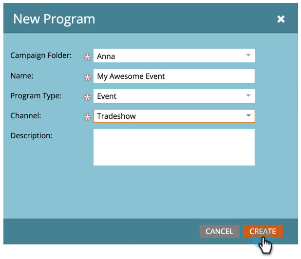

# Créer un Programme de Événement {#create-a-new-event-program}

Les événements vous permettent d&#39;automatiser les événements en ligne et hors ligne ! Capturez l&#39;état de vos employés à mesure qu&#39;ils progressent au cours de différentes étapes et obtenez des mesures précises du retour sur investissement pour vos initiatives marketing.

1. Accédez à Activités **** marketing.

   

1. Sélectionnez le dossier du nouveau programme. Sélectionnez **Nouveau** , puis cliquez sur **Nouveau Programme**.

   

1. Choisissez un nom pour votre événement. Puis, sous Type **de** Programme, sélectionnez **Événement**.

   

1. Sélectionnez un **Canal. **

   >[!NOTE]
   >
   >Les canaux définissent les différents états qu&#39;une personne peut avoir dans un programme. Pour en savoir plus sur l&#39;adhésion [au](../../../../product-docs/core-marketo-concepts/programs/creating-programs/understanding-program-membership.md) programme, cliquez ici.

   

1. Cliquez sur **Créer**.

    

1. Pour planifier votre événement, sélectionnez **Planifier la Vue** et cliquez sur celle-ci dans le calendrier pour ouvrir la fenêtre contextuelle. Entrez des dates et des heures.

   

1. Faites glisser la barre sur **Confirmé** lorsque vous avez terminé.

   

Ta-da ! Votre nouveau événement s&#39;affiche désormais dans l&#39;arborescence. Une fois votre événement créé, créez les [landings page](../../../../product-docs/demand-generation/landing-pages/free-form-landing-pages/create-a-free-form-landing-page.md), les [formulaires](../../../../product-docs/demand-generation/forms/creating-a-form/create-a-form.md)et les [courriels](../../../../product-docs/email-marketing/email-programs/creating-an-email-program/create-an-email-program.md) pour inviter vos invités ! Vous voudrez également vous familiariser avec la vue Planning du programme.

>[!NOTE]
>
>**Articles connexes**
>
>* [Calendrier marketing](http://docs.marketo.com/display/docs/marketing+calendar)
>* [Utilisation des coûts de période dans un Programme](../../../../product-docs/core-marketo-concepts/programs/working-with-programs/using-period-costs-in-a-program.md)

>

