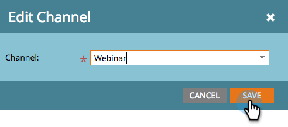

# Modifier un Canal de Événement {#edit-an-event-channel}

Vous pouvez modifier le type de canal à partir de l&#39;onglet **Résumé** du événement ou de son onglet **Configuration**.

>[!NOTE]
>
>Cette option est disponible uniquement pour les événements qui n’ont pas de membres associés. Une fois qu’un événement comporte des membres, vous ne pouvez plus modifier le type de canal.

>[!NOTE]
>
>Un programme est une initiative marketing spécifique. Le **canal** est destiné à être le mécanisme de diffusion, tel que Webinaire, Tradeshow ou Annonce en ligne. Vous pouvez voir différentes options de canal dans votre liste déroulante, selon ce qui est disponible dans votre propre instance. Vous pouvez également [créer votre propre canal.](http://docs.marketo.com/display/DOCS/Create+a+Program+Channel)

## Dans l’onglet Résumé {#from-the-summary-tab}

1. Dans **Activités marketing**, sélectionnez votre événement dans l&#39;arborescence.

   

1. Accédez à la vue **Résumé**.

   

1. Sous la catégorie **Paramètres**, sélectionnez le **Canal actuel** affiché comme hyperlien.

   

1. Dans la liste déroulante, sélectionnez un nouveau canal.

   

1. Cliquez sur **Enregistrer**.

   

## Dans l&#39;onglet Configuration {#from-the-setup-tab}

Un nouveau type de canal peut également être affecté à partir de l’onglet **Configuration** du événement.

1. Sélectionnez votre événement dans l&#39;arborescence.

   

1. Accédez à l&#39;onglet **Configuration**. Doublon-cliquez sur le **Canal actuel**.

   

1. Sélectionnez un nouveau **Canal**.

   

1. Cliquez sur **Enregistrer.**

   

Félicitations ! Vous venez de modifier un canal !
