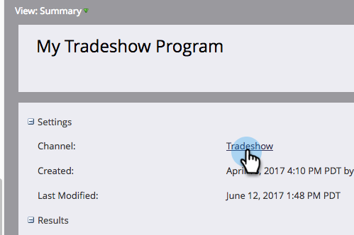
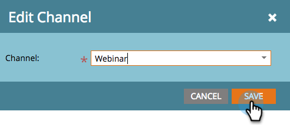

# Modifier un canal d’événement {#edit-an-event-channel}

Vous pouvez modifier le type de canal à partir de l’onglet **Résumé** de l’événement ou de son onglet **Configuration**.

>[!NOTE]
>
>Cette option n’est disponible que pour les événements auxquels aucun membre n’est associé. Une fois qu’un événement comporte des membres, vous ne pouvez pas modifier le type de canal.

>[!NOTE]
>
>Un programme est une initiative marketing spécifique. Le **canal** est conçu pour être le mécanisme de diffusion, comme un webinaire, un salon professionnel ou une publicité en ligne. Il se peut que différentes options de canal s’affichent dans la liste déroulante, selon les options disponibles dans votre propre instance. Vous pouvez également [créer votre propre canal](/help/marketo/product-docs/administration/tags/create-a-program-channel.md).

## À partir de l’onglet Résumé {#from-the-summary-tab}

1. Dans **[!UICONTROL Activités marketing]**, sélectionnez votre événement dans l’arborescence.

   

1. Accédez à la vue **[!UICONTROL Résumé]**.

   

1. Sous la catégorie **[!UICONTROL Paramètres]**, sélectionnez le **[!UICONTROL Canal]** affiché sous forme de lien hypertexte.

   

1. Dans la liste déroulante, sélectionnez un nouveau **[!UICONTROL canal]**.

   

1. Cliquez sur **[!UICONTROL Enregistrer]**

   

## Depuis l’onglet Configuration {#from-the-setup-tab}

Un nouveau type de canal peut également être attribué à partir de l’onglet **[!UICONTROL Configuration]** de l’événement.

1. Sélectionnez votre événement dans l’arborescence.

   

1. Accédez à l’onglet **[!UICONTROL Configuration]**. Double-cliquez sur le **canal** actif.

   

1. Sélectionnez un nouveau **[!UICONTROL canal]**.

   

1. Cliquez sur **[!UICONTROL Enregistrer]**

   

Le canal a été modifié.
