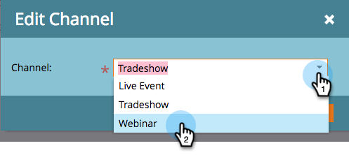

# Modification d’un canal d’événement {#edit-an-event-channel}

Vous pouvez modifier le type de canal à partir de l’onglet **Résumé** de l’événement ou de son onglet **Configuration**.

>[!NOTE]
>
>Cette option est disponible uniquement pour les événements qui n’ont pas de membres associés. Une fois qu’un événement comporte des membres, vous ne pouvez pas modifier le type de canal.

>[!NOTE]
>
>Un programme est une initiative marketing spécifique. **channel** est conçu pour être le mécanisme de diffusion, comme le webinaire, le commerce ou la publicité en ligne. Vous pouvez voir différentes options de canal dans votre liste déroulante, selon ce qui est disponible dans votre propre instance. Vous pouvez également [créer votre propre canal](/help/marketo/product-docs/administration/tags/create-a-program-channel.md).

## Depuis l’onglet Résumé {#from-the-summary-tab}

1. Dans **Activités marketing**, sélectionnez votre événement dans l’arborescence.

   

1. Accédez à la vue **Summary**.

   

1. Sous la catégorie **Paramètres**, sélectionnez le **Canal** actuel affiché en tant que lien hypertexte.

   

1. Sélectionnez un nouveau canal dans la liste déroulante.

   

1. Cliquez sur **Enregistrer**.

   

## Dans l’onglet Configuration {#from-the-setup-tab}

Un nouveau type de canal peut également être attribué à partir de l’onglet **Configuration** de l’événement.

1. Sélectionnez votre événement dans l’arborescence.

   

1. Accédez à l’onglet **Setup** (Configuration). Double-cliquez sur le **Canal** actif.

   

1. Sélectionnez un nouveau **Canal**.

   

1. Cliquez sur **Enregistrer**.

   

Félicitations ! Vous venez de modifier un canal !
