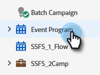
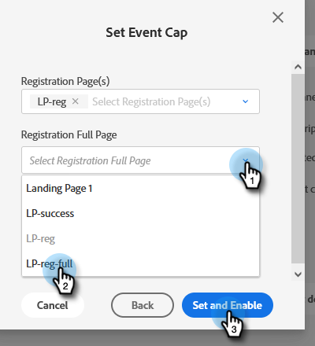

# Définition d’une limite d’événement {#setting-an-event-cap}

Limitez le nombre de personnes pouvant s’inscrire à votre événement avec une limite d’événement.

>[!NOTE]
>
>Tout le monde n’a pas acheté cette fonctionnalité. Pour plus d’informations, contactez l’équipe du compte Adobe (votre gestionnaire de compte).

>[!IMPORTANT]
>Vous devez avoir au moins deux pages de destination approuvées (une page Enregistrement et une page Enregistrement complet) dans le programme avant de pouvoir définir une limite d’événement.

>[!NOTE]
>
>Pour libérer de l’espace dans un événement, le membre de programme doit être supprimé (vous pouvez le faire en mettant à jour son statut sur « Pas dans le programme »).

1. Sélectionnez votre programme d’événement.

   

1. Dans la présentation, recherchez [!UICONTROL Limitation d’événement] et cliquez sur **[!UICONTROL Non défini]**.

   

1. Saisissez le nombre maximal de personnes que vous souhaitez pouvoir inscrire à votre événement et cliquez sur **[!UICONTROL Suivant]**.

   

1. Cliquez sur le menu déroulant [!UICONTROL Page(s) d’enregistrement] et sélectionnez la page de destination qui servira de page d’enregistrement.

   

1. Cliquez sur le menu déroulant **[!UICONTROL Page complète d’enregistrement]** et sélectionnez la page de destination qui servira de page complète d’enregistrement. Cliquez sur **[!UICONTROL Définir et activer]** lorsque vous avez terminé.

   

   Tout est prêt. Si vous décidez de modifier les détails de la limite d’événement, cliquez sur le texte bleu en regard de [!UICONTROL Limite d’événement].

   
