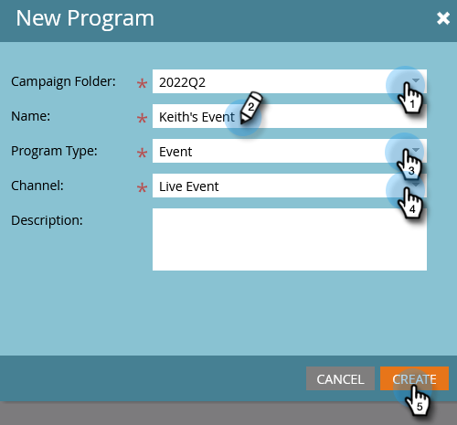
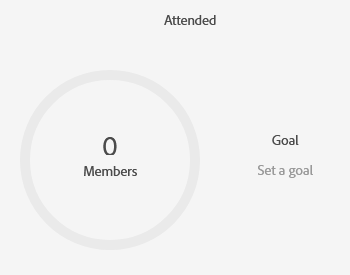

# Définition des objectifs d’événement {#setting-event-goals}

Indiquez des objectifs spécifiques à vos événements et vérifiez leurs performances.

>[!IMPORTANT]
>Tous les clients n’ont pas accès à cette fonctionnalité. Pour plus d’informations, contactez votre responsable du succès client.

1. Créez un programme d’événement.

   

1. Choisissez la [!UICONTROL Dossier Campaign], attribuez à votre événement un [!UICONTROL Nom], sélectionnez la variable [!UICONTROL Type de programme] et [!UICONTROL Canal]. Cliquez sur **[!UICONTROL Créer]** une fois terminé.

   

1. Dans votre événement, cliquez sur le bouton **[!UICONTROL Rapports]** .

   

1. Saisissez l’objectif pour [!UICONTROL Inscrits] en cliquant **[!UICONTROL Définition d’un objectif]**. Saisissez le nombre dans et appuyez sur Entrée.

   

   

1. Répétez les mêmes étapes pour [!UICONTROL Attaché].

   

>[!NOTE]
>
>Vous ne pouvez pas définir d’objectifs pour un événement une fois qu’il a commencé.

Et voilà ! Vérifiez l’état de l’objectif de l’événement en cliquant sur [!UICONTROL Rapports] .
