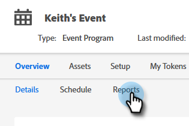

# Définition d’objectifs d’événement {#setting-event-goals}

Fixez des objectifs précis pour vos événements et observez leurs performances.

>[!IMPORTANT]
>
>Tout le monde n’a pas acheté cette fonctionnalité. Pour plus d’informations, contactez l’équipe du compte Adobe (votre gestionnaire de compte).

1. Créez un programme d’événement.

   

1. Sélectionnez le [!UICONTROL dossier de campagne], attribuez un [!UICONTROL nom] à votre événement, puis sélectionnez les [!UICONTROL type de programme] et [!UICONTROL canal]. Cliquez sur **[!UICONTROL Créer]** lorsque vous avez terminé.

   

1. Dans votre événement, cliquez sur l’onglet **[!UICONTROL Rapports]**.

   

1. Saisissez l’objectif pour [!UICONTROL Enregistré] en cliquant sur **[!UICONTROL Définir un objectif]**. Saisissez le nombre dans et appuyez sur Entrée.

   

   

1. Répétez les mêmes étapes pour [!UICONTROL Participants].

   

>[!NOTE]
>
>Vous ne pouvez pas définir d’objectifs pour un événement après son démarrage.

Et c&#39;est tout ! Vérifiez le statut de l’objectif de votre événement en cliquant sur l’onglet [!UICONTROL Rapports].
