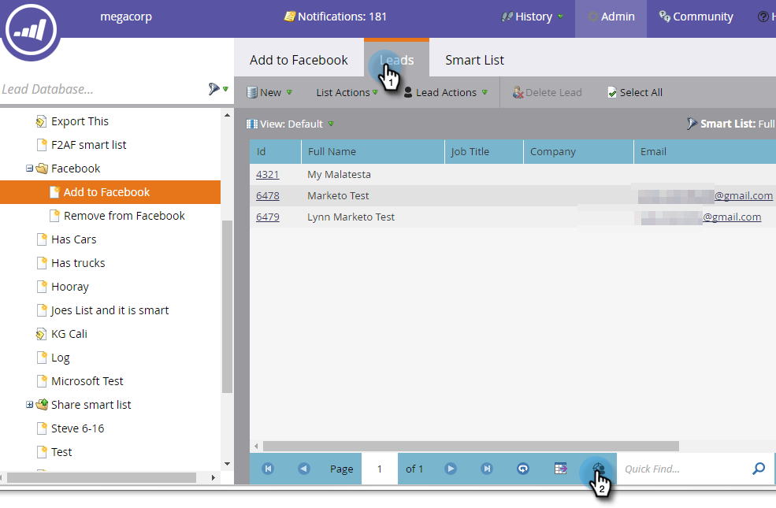

# Création d’une audience personnalisée dans Facebook {#create-a-custom-audience-in-facebook}

>[!PREREQUISITES]
>
>* [ Ajoutez des audiences personnalisées Facebook en tant que service LaunchPoint ](/help/marketo/product-docs/demand-generation/ad-network-integrations/add-facebook-custom-audiences-as-a-launchpoint-service.md){target="_blank"} dans la section Admin.
>* [Acceptez les termes d’audiences personnalisées Facebook](https://www.facebook.com/ads/manage/customaudiences/tos.php){target="_blank"} dans votre compte Facebook.

>[!TIP]
>
>En savoir plus sur les [audiences personnalisées dans Facebook](https://www.facebook.com/help/341425252616329){target="_blank"}.

1. Recherchez et sélectionnez la liste dynamique ou statique contenant les pistes à partir desquelles vous souhaitez créer l’audience.

   

1. Sélectionnez l’onglet **Pistes** , puis cliquez sur l’icône **Envoyer par le biais du Bridge** en bas de l’écran.

   

1. Sélectionnez **Facebook** et cliquez sur **Suivant**.

   

1. Cliquez sur la liste déroulante **Audience** et sélectionnez **+ Nouvelle audience**.

   

   >[!IMPORTANT]
   >
   >L’API Facebook permet jusqu’à 500 audiences personnalisées par compte publicitaire Facebook.

1. Saisissez un **nom d’audience**. Cliquez sur **Mettre à jour**.

   

   >[!NOTE]
   >
   >Si vous disposez de plusieurs comptes de publicité Facebook, une liste déroulante supplémentaire s’affiche, vous permettant de sélectionner le compte de publicité dans lequel cette audience est créée.

   >[!TIP]
   >
   >Souhaitez-vous échanger une nouvelle audience avec une audience existante actuellement associée à un ensemble ou à un groupe de publicités ? Cochez la case **Remplacer une audience existante** . Ce faisant, **not** supprimera l’audience remplacée.

1. Lorsque vous avez terminé, la boîte de dialogue d’état est mise à jour.

   

   Et c&#39;est tout ! Dans Facebook, vous verrez la nouvelle audience dans **Ads Manager** > **Audiences**.

   

   >[!NOTE]
   >
   >Toutes les listes que vous placez sur Facebook deviennent statiques. Les listes dynamiques dans Marketo ne mettent pas automatiquement à jour la liste des audiences dans Facebook pour prendre en compte les modifications apportées après le transfert.

   >[!TIP]
   >
   >Voir le [parcours d’apprentissage Facebook pour les clients Marketo](https://facebook.exceedlms.com/student/enrollments/create_enrollment_from_token/BF9TqSaCvM73PP4ScjhCm4fi){target="_blank"}. Il couvre tout ce que vous devez savoir, de la création d’une page Facebook au ciblage de vos publicités Facebook à l’aide des intégrations de réseau publicitaire Marketo.

   >[!MORELIKETHIS]
   >
   >[Ajouter des pistes à une audience personnalisée dans Facebook](/help/marketo/product-docs/demand-generation/facebook/add-leads-to-a-custom-audience-in-facebook.md)
