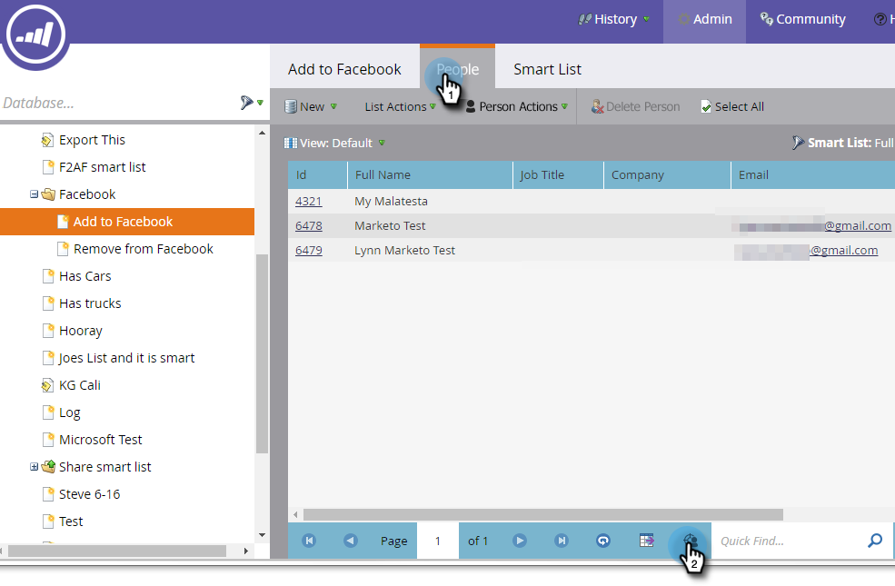

# Création d’une audience personnalisée dans Facebook {#create-a-custom-audience-in-facebook}

>[!PREREQUISITES]
>
>* [Ajout d’audiences personnalisées Facebook en tant que service LaunchPoint](/help/marketo/product-docs/demand-generation/ad-network-integrations/add-facebook-custom-audiences-as-a-launchpoint-service.md){target="_blank"} dans la section Admin.
>* [Acceptez les Conditions relatives aux audiences personnalisées de Facebook](https://www.facebook.com/ads/manage/customaudiences/tos.php){target="_blank"} dans votre compte Facebook.

>[!TIP]
>
>En savoir plus sur [les audiences personnalisées sur Facebook](https://www.facebook.com/help/341425252616329){target="_blank"}.

1. Recherchez et sélectionnez la liste dynamique ou statique qui contient les prospects à partir desquels vous souhaitez créer l’audience.

   

1. Sélectionnez l’onglet **Leads**, puis cliquez sur l’icône **Envoyer via Ad Bridge** en bas.

   

1. Sélectionnez **Facebook** et cliquez sur **Suivant**.

   

1. Cliquez sur le menu déroulant **Audience** et sélectionnez **+ Nouvelle audience**.

   

   >[!IMPORTANT]
   >
   >L’API Facebook autorise jusqu’à 500 audiences personnalisées par compte publicitaire Facebook.

1. Saisissez un **Nom de l’audience**. Cliquez sur **Mettre à jour**.

   

   >[!NOTE]
   >
   >Si vous disposez de plusieurs comptes publicitaires Facebook, une liste déroulante supplémentaire s’affiche, vous permettant de choisir dans quel compte publicitaire cette audience est créée.

   >[!TIP]
   >
   >Vous souhaitez échanger une nouvelle audience avec une audience existante actuellement associée à une visionneuse d’annonces ou à un groupe ? Cochez la case **Remplacer une audience existante**. Cela ne supprimera **pas** l’audience remplacée.

1. Une fois cette opération terminée, la boîte de dialogue d’état est mise à jour.

   

   Et c&#39;est tout ! Dans Facebook, vous verrez la nouvelle audience dans **Gestionnaire de publicités** > **Audiences**.

   

   >[!NOTE]
   >
   >Toutes les listes que vous transmettez à Facebook deviennent statiques. Les listes dynamiques dans Marketo ne mettent pas automatiquement à jour la liste des audiences dans Facebook pour refléter les modifications apportées après le transfert.

   >[!MORELIKETHIS]
   >
   >[Ajout de leads à une audience personnalisée dans Facebook](/help/marketo/product-docs/demand-generation/facebook/add-leads-to-a-custom-audience-in-facebook.md)
