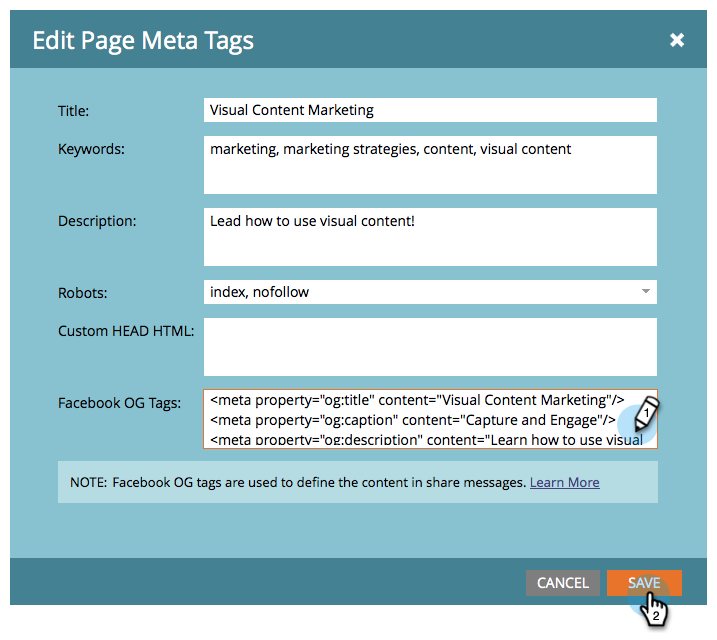

# Modification des paramètres de publication enrichie Facebook {#edit-facebook-rich-post-settings}

Personnalisez les publications lorsque des personnes vous partagent sur Facebook.

>[!AVAILABILITY]
>
>Tous les clients n’ont pas acheté cette fonctionnalité. Contactez votre représentant commercial pour plus d&#39;informations.

Marketo [applications sociales](/help/marketo/product-docs/demand-generation/social/social-functions/add-a-social-button-on-a-landing-page.md) autorisez vos prospects à partager vos landing pages avec leurs connexions sur les réseaux sociaux tels que Facebook, Twitter, etc. Les balises facebook OpenGraph (balises OG) vous permettent de spécifier les informations de votre page d’entrée qui sont incluses dans les publications Facebook.

## Sélectionner les options de publication enrichie {#select-rich-post-options}

Vous pouvez spécifier les types d’informations de page à utiliser dans les publications enrichies Facebook générées par des partages provenant de votre page d’entrée.

1. Sélectionner **Message facebook** dans l’éditeur de votre **YouTube** vidéo ou bouton social.

   

1. Sélectionnez l’une des options suivantes pour votre message Facebook.

   * Ajouter du contenu statique : Sélectionnez cette option pour saisir manuellement le titre, la légende et la description.

   

   * Ajouter du contenu dynamique : Votre application sociale peut utiliser les `<TITLE>`, `<CAPTION>`, et `<DESCRIPTION>` balises pour renseigner votre publication enrichie.

   

   >[!NOTE]
   >
   >Elles doivent déjà exister dans la source de la page. Pour un meilleur contrôle, vous pouvez ajouter des balises Facebook OG spécifiques à votre page d’entrée.

   * Ne pas ajouter de contenu riche : Limite les publications Facebook de votre page d’entrée au message principal et au lien.

   

## Ajout de balises Facebook OG à une page d’entrée {#add-facebook-og-tags-to-a-landing-page}

Pour contrôler les éléments de page qui seront inclus dans les partages Facebook à partir de votre page d’entrée, vous pouvez ajouter des balises Facebook OG (Open Graph) pour le titre, la légende et la description de votre page d’entrée.

1. Ouvrez la landing page qui contient votre **Vidéo YouTube** ou bouton social.

   

   Le **Concepteur de page d’entrée** s’ouvre dans une nouvelle fenêtre.

1. Sélectionner **Actions de page d’entrée** > **Modification des métadonnées de page**.

   

1. Ajoutez le HTML qui définit og:title, og:caption et og:description. Copiez et collez ces lignes et remplacez le texte de l’espace réservé :

   `<meta property="og:title" content="My Post Title"/>`

   `<meta property="og:caption" content="My Post Caption"/>`

   `<meta property="og:description" content="This text appears in the post description"/>`

   

>[!NOTE]
>
>Veillez à utiliser la syntaxe de HTML appropriée lors de l’ajout des balises OG.
