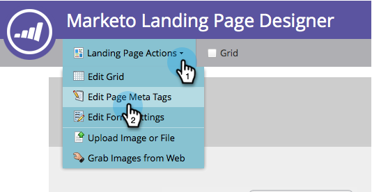

# Modification des paramètres de publication enrichie Facebook {#edit-facebook-rich-post-settings}

Personnalisez les publications lorsque des personnes vous partagent sur Facebook.

>[!AVAILABILITY]
>
>Tous les utilisateurs de Marketo Engage n’ont pas acheté cette fonctionnalité. Pour plus d’informations, contactez l’équipe du compte d’Adobe (votre gestionnaire de compte).

Les [applications sociales](/help/marketo/product-docs/demand-generation/social/social-functions/add-a-social-button-on-a-landing-page.md) de Marketo permettent à vos prospects de partager vos landing pages avec leurs connexions sur les réseaux sociaux tels que Facebook, Twitter, etc. Les balises facebook OpenGraph (balises OG) vous permettent de spécifier les informations de votre page d’entrée qui sont incluses dans les publications Facebook.

## Sélectionner les options de publication enrichie {#select-rich-post-options}

Vous pouvez spécifier les types d’informations de page à utiliser dans les publications enrichies Facebook générées par des partages provenant de votre page d’entrée.

1. Sélectionnez **Message Facebook** dans l’éditeur pour votre vidéo ou bouton social **YouTube**.

   

1. Sélectionnez l’une des options suivantes pour votre message Facebook.

   * Ajouter du contenu statique : sélectionnez cette option pour saisir manuellement le titre, la légende et la description.

   

   * Ajouter du contenu dynamique : votre application sociale peut utiliser les balises `<TITLE>`, `<CAPTION>` et `<DESCRIPTION>` de votre page d’entrée pour remplir votre publication enrichie.

   

   >[!NOTE]
   >
   >Elles doivent déjà exister dans la source de la page. Pour un meilleur contrôle, vous pouvez ajouter des balises Facebook OG spécifiques à votre page d’entrée.

   * Ne pas ajouter de contenu riche : limite les publications Facebook de votre landing page au message principal et au lien.

   

## Ajout de balises Facebook OG à une page d’entrée {#add-facebook-og-tags-to-a-landing-page}

Pour contrôler les éléments de page qui seront inclus dans les partages Facebook à partir de votre page d’entrée, vous pouvez ajouter des balises Facebook OG (Open Graph) pour le titre, la légende et la description de votre page d’entrée.

1. Ouvrez la page d’entrée contenant la **vidéo YouTube** ou le bouton social.

   

   Le **Designer de page d’entrée** s’ouvre dans une nouvelle fenêtre.

1. Sélectionnez **Actions de page d’entrée** > **Modifier les balises de métadonnées de page**.

   

1. Ajoutez l’HTML qui définit og:title, og:caption et og:description. Copiez et collez ces lignes et remplacez le texte de l’espace réservé :

   `<meta property="og:title" content="My Post Title"/>`

   `<meta property="og:caption" content="My Post Caption"/>`

   `<meta property="og:description" content="This text appears in the post description"/>`

   

>[!NOTE]
>
>Veillez à utiliser la syntaxe d’HTML appropriée lors de l’ajout des balises OG.
