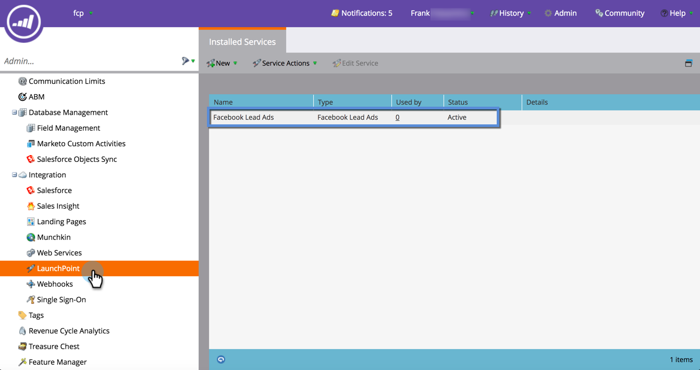
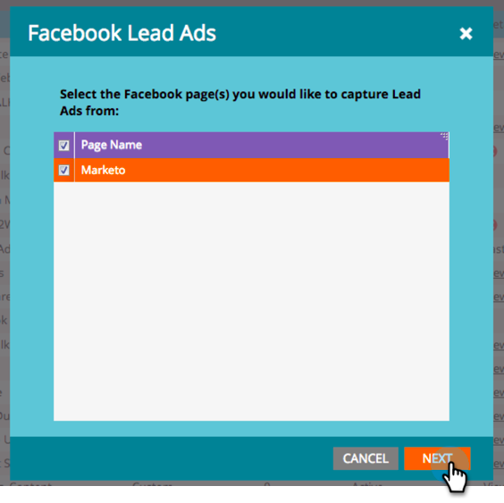

# Faire correspondre les champs personnalisés à Marketo {#map-custom-fields-to-marketo}

Par défaut, vous pouvez collecter plus que les informations standard stockées par Facebook, comme la fréquence à laquelle une personne utilise votre service de diffusion en ligne. Pour ce faire, [créez des questions personnalisées](https://www.facebook.com/business/help/774623835981457?helpref=uf_permalink) dans vos publicités Facebook.

Cependant, **Marketo ne début pas automatiquement la collecte de ces données**.** **Pour que Marketo puisse capturer en début les valeurs de champ personnalisé, vous **devez** mapper ces champs personnalisés à un champ dans Marketo.

Voici comment configurer cela dans la zone LaunchPoint d’Admin.

>[!NOTE]
>
>**Autorisations d’administrateur requises**

1. Accédez à la zone Admin et cliquez sur **LaunchPoint**. Sous Services installés, recherchez et modifiez **Publicités de piste Facebook**.

   

1. Cliquez sur **Suivant**.

   

1. Laissez le compte autorisé tel quel. Effectuez **aucune modification**. Cliquez sur **Suivant**.

   

1. Comme auparavant, conservez les pages sélectionnées telles quelles : **ne pas** apporter de modifications. Cliquez sur **Suivant**.

   

1. C’est ici que vous mappez le champ Facebook personnalisé à votre champ Marketo. Cliquez sur **Ajouter.**

   ** 

   **

1. Sur la nouvelle ligne, entrez le nom de votre champ personnalisé Facebook.

   

   >[!NOTE]
   >
   >Seuls les champs enregistrés dans les modèles de formulaires Facebook apparaissent ici comme des options.

1. Cliquez sur dans la colonne **Champ Marketo**. Tapez pour rechercher le champ à mapper. Une fois que vous avez sélectionné un champ, cliquez sur **Enregistrer**.

   

   >[!NOTE]
   >
   >Si vous n’avez pas encore de champ dans Marketo pour mapper le champ Facebook à, découvrez comment [créer des champs personnalisés](../../../../product-docs/administration/field-management/create-a-custom-field-in-marketo.md).

>[!CAUTION]
>
>Vous **devez** passer par ce processus pour tout nouveau champ Facebook afin que Marketo collecte les données.

