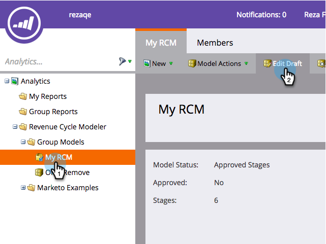
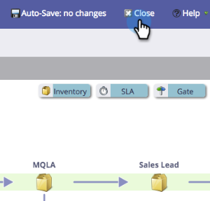

# Configurer [!DNL Facebook] conversions hors ligne {#set-up-facebook-offline-conversions}

En renvoyant les données de conversion hors ligne à [!DNL Facebook] pour les personnes créées par le biais d’annonces de leads, votre équipe publicitaire peut optimiser ses dépenses publicitaires mieux que jamais. Voici comment le configurer.

>[!PREREQUISITES]
>
>* Vous devez [configurer les publicités de lead Facebook](/help/marketo/product-docs/demand-generation/facebook/set-up-facebook-lead-ads.md).
>* Un modèle approuvé doit être présent dans [Revenue Cycle Modeler](/help/marketo/product-docs/reporting/revenue-cycle-analytics/revenue-cycle-models/understanding-revenue-models.md).

## Configuration d’administration {#admin-configuration}

1. Accédez à Marketo **[!UICONTROL Admin]**.

   

1. Accédez à **[!UICONTROL LaunchPoint]** et double-cliquez sur le service Facebook Lead Ads que vous avez créé précédemment.

   >[!NOTE]
   >
   >Si vous ne l’avez pas fait, allez-y et [Configurer [!UICONTROL publicités de prospect Facebook]](/help/marketo/product-docs/demand-generation/facebook/set-up-facebook-lead-ads.md), puis revenez ici.

   

1. Si vous le souhaitez, modifiez le **[!UICONTROL Nom d’affichage]** pour inclure les conversions hors ligne. Cliquez sur **[!UICONTROL Suivant]**.

   

1. Cochez **[!UICONTROL Activer les conversions hors ligne]** et cliquez sur **[!UICONTROL Suivant]**.

   

1. Cliquez sur **[!UICONTROL Suivant]**.

   

1. Cliquez sur **[!UICONTROL Enregistrer]**

   

   Doux ! Vous avez à mi-chemin de l’activation des conversions hors ligne [!DNL Facebook]. Passons à la Modeler du cycle de revenus pour mapper les étapes.

   

## Configuration de Revenue Cycle Modeler {#revenue-cycle-modeler-configuration}

1. Accédez à **[!UICONTROL Analytics]**.

   

1. Sélectionnez votre modèle et cliquez sur **[!UICONTROL Modifier le brouillon]**.

   

   >[!NOTE]
   >
   >Actuellement, il existe 10 événements [!DNL Facebook] auxquels vous pouvez mapper les étapes du cycle du chiffre d’affaires :
   >
   >* Ajouts d’informations de paiement
   >* Ajouts au panier
   >* Ajouts à la liste de souhaits
   >* Enregistrements terminés
   >* Passages en caisse lancés
   >* Personne
   >* Autres
   >* Achat
   >* Recherches
   >* Affichage de contenu

1. Sélectionnez l’étape à mapper, puis, dans le menu déroulant **[!UICONTROL Conversion Facebook]**, sélectionnez l’événement [!DNL Facebook] auquel vous souhaitez le mapper. Répétez cette étape pour mapper toutes les étapes de votre RCM aux étapes de conversion hors ligne sur [!DNL Facebook].

   

1. Une fois le mappage terminé, fermez le modèle.

   

1. Approuvez votre modèle et vous avez terminé !

   

   Désormais, lorsque les leads d’annonces de leads atteignent les étapes que vous avez mappées, les conversions sont envoyées à [!DNL Facebook] pour la création de rapports.

   >[!CAUTION]
   >
   >Vérifiez votre compte [!DNL Facebook] et assurez-vous que toutes les [&#x200B; publicités sont associées](https://www.facebook.com/business/url/?href=%2Fbusiness%2Fhelp%2Fwww%2F1776828022605281&cmsid&creative=link&creative_detail=advertiser-help-center&create_type&destination_cms_id&orig_http_referrer) au jeu d’événements Conversions hors ligne Marketo . Si ce n&#39;est pas le cas, l&#39;attribution risque de ne pas fonctionner.

   >[!NOTE]
   >
   >Les données de conversion hors ligne sont envoyées de Marketo à [!DNL Facebook] plusieurs fois par jour.

>[!MORELIKETHIS]
>
>[Présentation  [!DNL Facebook]  conversions hors ligne](/help/marketo/product-docs/demand-generation/facebook/understanding-facebook-offline-conversions.md)
