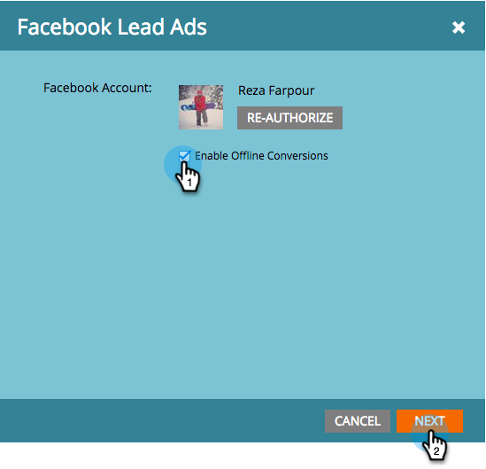

# Configuration des conversions hors ligne de Facebook {#set-up-facebook-offline-conversions}

En renvoyant les données de conversion hors ligne à Facebook pour les personnes créées par le biais de pistes publicitaires, votre équipe publicitaire peut optimiser les dépenses publicitaires de manière plus optimale que jamais. Voici comment le mettre en place.

>[!PREREQUISITES]
>
>* Vous devez [configurer Facebook Lead Ads](/help/marketo/product-docs/demand-generation/facebook/set-up-facebook-lead-ads.md).
>* Vous devez disposer d’un modèle approuvé dans [Revenue Cycle Modeler](/help/marketo/product-docs/reporting/revenue-cycle-analytics/revenue-cycle-models/understanding-revenue-models.md).

## Configuration de l’administrateur {#admin-configuration}

1. Accédez à Marketo **Admin**.

   

1. Accédez à **LaunchPoint** et double-cliquez sur le service Facebook Lead Ads que vous avez créé précédemment.

   >[!NOTE]
   >
   >Si vous n’avez pas fait cela, allez-y et [Configurez Facebook Lead Ads](/help/marketo/product-docs/demand-generation/facebook/set-up-facebook-lead-ads.md), puis revenez ici.

   

1. Si vous le souhaitez, modifiez le **nom d’affichage** afin d’inclure les conversions hors ligne. Cliquez sur **Suivant**.

   

1. Cochez **Activer les conversions hors ligne** et cliquez sur **Suivant**.

   

1. Cliquez sur **Suivant**.

   

1. Cliquez sur **Enregistrer**.

   

   Doux ! Vous avez terminé à mi-chemin d’activer les conversions hors ligne de Facebook. Passez à la Modeler du cycle de revenu pour mapper les scènes.

   

## Configuration de Recettes Cycle Modeler {#revenue-cycle-modeler-configuration}

1. Accédez à **Analytics**.

   

1. Sélectionnez votre modèle et cliquez sur **Modifier le brouillon**.

   

   >[!NOTE]
   >
   >Actuellement, il existe 10 événements Facebook que vous pouvez mettre en correspondance des étapes du cycle du chiffre d’affaires avec :
   >
   >* Ajout d’informations de paiement
   >* Ajouts au panier
   >* Ajoute à la liste des souhaits
   >* Inscriptions terminées
   >* Passages en caisse commencés
   >* Individu
   >* Autres
   >* Achat
   >* Recherches
   >* Affichage de contenu

1. Sélectionnez l’étape à mapper, puis, dans la liste déroulante **Conversion Facebook**, sélectionnez l’événement Facebook auquel vous souhaitez le mapper. Répétez cette étape pour mapper toutes les étapes de votre CRM aux étapes de conversion hors ligne sur Facebook.

   

1. Une fois le mappage terminé, fermez le modèle.

   

1. Approuvez votre modèle et vous avez terminé !

   

   Désormais, lorsque les pistes publicitaires de piste atteignent les étapes que vous avez mappées, les conversions sont envoyées à Facebook pour la création de rapports.

   >[!CAUTION]
   >
   >Vérifiez votre compte Facebook et assurez-vous que toutes les [publicités sont associées](https://www.facebook.com/business/url/?href=%2Fbusiness%2Fhelp%2Fwww%2F1776828022605281&amp;cmsid&amp;creative=link&amp;creative_detail=advertiser-help-center&amp;create_type&amp;destination_cms_id&amp;orig_http_referrer) au jeu d’événements de conversion hors ligne Marketo. Si ce n’est pas le cas, l’attribution des publicités peut ne pas fonctionner.

   >[!NOTE]
   >
   >Les données de conversion hors ligne sont envoyées de Marketo à Facebook plusieurs fois par jour.

>[!MORELIKETHIS]
>
>[Comprendre les conversions hors ligne de Facebook](/help/marketo/product-docs/demand-generation/facebook/understanding-facebook-offline-conversions.md)
