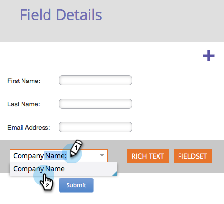

# Ajouter un champ à un formulaire {#add-a-field-to-a-form}

Une fois que vous avez [créé votre formulaire](create-a-form.md) et [sélectionné un thème](select-a-form-theme.md), vous pouvez ajouter des champs supplémentaires à remplir par les utilisateurs. Voici comment.

1. Accédez à **Marketing** **Activités**.

   

1. Sélectionnez votre formulaire, puis cliquez sur **Modifier** le **formulaire**.

   

1. Cliquez sur le signe **+** .

   

   >[!NOTE]
   >
   >Lorsque vous créez un formulaire, le prénom, le nom et l’adresse électronique sont automatiquement ajoutés.

1. Recherchez et sélectionnez le champ à ajouter à votre formulaire.

   

1. Ajoutez autant de champs que nécessaire et cliquez sur **Terminer**.

   

1. Cliquez maintenant sur** Approuver et fermer**.

   

>[!NOTE]
>
>**Rappel**
>
>Veillez à approuver les brouillons de landing page créés en raison des modifications apportées au formulaire.

Pas mal du tout. Continuez votre bon travail ! Que diriez-vous d’apprendre à [créer un champ de formulaire requis](make-a-form-field-required.md) ensuite ?