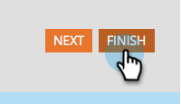

# Ajouter un champ à un formulaire {#add-a-field-to-a-form}

Une fois que vous avez [créé votre formulaire](/help/marketo/product-docs/demand-generation/forms/creating-a-form/create-a-form.md){target="_blank"} et [sélectionné un thème](/help/marketo/product-docs/demand-generation/forms/creating-a-form/select-a-form-theme.md){target="_blank"}, vous pouvez ajouter des champs supplémentaires à remplir par les personnes. Voici comment faire.

1. Accédez à **[!UICONTROL Activités marketing]**.

   

1. Sélectionnez votre formulaire et cliquez sur **[!UICONTROL Modifier le brouillon]**

   

   >[!NOTE]
   >
   >Si le formulaire souhaité est à l’état _Approuvé_, vous devez d’abord cliquer sur **Créer un brouillon**.

1. Dans le formulaire, cliquez sur le signe **+**.

   

   >[!NOTE]
   >
   >Lorsque vous créez un formulaire, les [!UICONTROL Prénom], [!UICONTROL Nom] et [!UICONTROL Adresse e-mail] sont automatiquement ajoutés.

1. Recherchez et sélectionnez le champ que vous souhaitez ajouter à votre formulaire.

   

1. Ajoutez autant de champs que nécessaire, puis cliquez sur **[!UICONTROL Terminer]**.

   

1. Cliquez sur **[!UICONTROL Approuver et fermer]**.

   

>[!NOTE]
>
>Veillez à approuver tous les brouillons de page de destination créés en raison des modifications apportées au formulaire.

>[!MORELIKETHIS]
>
>[Rendre un champ de formulaire obligatoire](/help/marketo/product-docs/demand-generation/forms/creating-a-form/make-a-form-field-required.md){target="_blank"}
