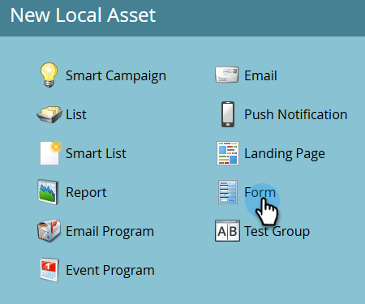

# Création d’un formulaire {#create-a-form}

Créez et utilisez un formulaire sur une page de destination pour générer de nouveaux noms ou capturer les données souhaitées.

>[!NOTE]
>
>Découvrez ce que fait Marketo Engage pour [protéger vos formulaires](https://nation.marketo.com/t5/Product-Documents/Forms-Service-Enhancements/ta-p/303670#M1038).

1. Accédez à **[!UICONTROL Activités marketing]**.

   

1. Recherchez le programme souhaité. Cliquez dessus avec le bouton droit et sélectionnez **[!UICONTROL Nouvelle ressource locale]**.

   

1. Sélectionnez **[!UICONTROL Formulaire]**.

   

1. Saisissez un formulaire **[!UICONTROL Nom]** et cliquez sur **[!UICONTROL Créer]**.

   

>[!TIP]
>
>La plupart des utilisateurs créent un formulaire pour chaque page de destination, mais vous pouvez également créer un formulaire à utiliser avec plusieurs pages de destination. C&#39;est à toi de décider !

>[!MORELIKETHIS]
>
>* [Sélectionner un thème de formulaire](/help/marketo/product-docs/demand-generation/forms/creating-a-form/select-a-form-theme.md)
>* [Ajouter un FieldSet à un formulaire](/help/marketo/product-docs/demand-generation/forms/form-fields/add-a-fieldset-to-a-form.md)
