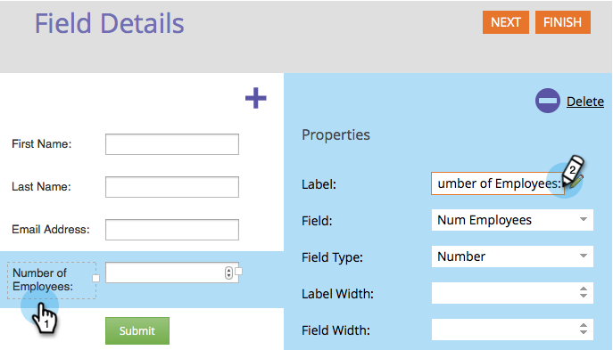

# Modification d’un libellé de champ dans un formulaire {#edit-a-field-label-in-a-form}

Vous pouvez remplacer le libellé d’un formulaire par n’importe quel libellé, vous pouvez même utiliser une image ou l’effacer complètement. Voici comment procéder.

1. Accédez à **[!UICONTROL Activités marketing]**.

   

1. Sélectionnez votre formulaire et cliquez sur **[!UICONTROL Créer un brouillon]**.

   

   >[!NOTE]
   >
   >Si votre formulaire n’est pas encore approuvé, cliquez sur **Modifier le brouillon**.

1. Sélectionnez votre champ, puis modifiez le **[!UICONTROL libellé]**. Les champs des paramètres de formulaire refléteront le ou les libellés que vous avez saisis.

   

   >[!TIP]
   >
   >Cliquez sur l’icône  pour accéder à l’éditeur de texte enrichi.

1. Cliquez sur **[!UICONTROL Terminer]**.

   

1. Cliquez sur **[!UICONTROL Approuver et fermer]**.

   

>[!NOTE]
>
>N’oubliez pas d’[approuver le brouillon de la page de destination](/help/marketo/product-docs/demand-generation/landing-pages/understanding-landing-pages/approve-unapprove-or-delete-a-landing-page.md){target="_blank"} créé par les modifications du formulaire.
