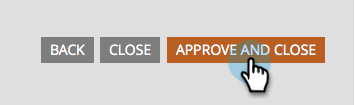

# Créer un formulaire de champ obligatoire {#make-a-form-field-required}

Lors de l’ajout [&#x200B; champs à un formulaire](/help/marketo/product-docs/demand-generation/forms/creating-a-form/add-a-field-to-a-form.md){target="_blank"} vous pouvez rendre certains d’entre eux obligatoires pour la personne qui les remplit. Voici comment faire.

1. Accédez à **[!UICONTROL Activités marketing]**.

   

1. Sélectionnez votre formulaire et cliquez sur **[!UICONTROL Créer un brouillon]**.

   

   >[!NOTE]
   >
   >Si votre formulaire n’est pas approuvé, cliquez sur **Modifier le brouillon**.

1. Sélectionnez le champ à rendre obligatoire et cochez la case **[!UICONTROL Est obligatoire]**.

   

1. Bien joué ! Cliquez sur **[!UICONTROL Terminer]**.

   

1. Cliquez sur **[!UICONTROL Approuver et fermer]**.

   

>[!NOTE]
>
>N’oubliez pas d’[approuver les pages de destination](/help/marketo/product-docs/demand-generation/landing-pages/understanding-landing-pages/approve-unapprove-or-delete-a-landing-page.md){target="_blank"} ce formulaire se conserve pour que les modifications soient mises en ligne.

>[!MORELIKETHIS]
>
>[Réorganiser les champs ajoutés au formulaire](/help/marketo/product-docs/demand-generation/forms/form-fields/reorder-fields-in-a-form.md){target="_blank"}
