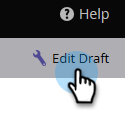

# Prévisualiser un formulaire {#preview-a-form}

Avant de publier, vous pouvez afficher le formulaire dans cet aperçu de formulaire simple et rapide.

1. Accédez à **[!UICONTROL Activités marketing]**.

   

1. Sélectionnez votre formulaire et cliquez sur **[!UICONTROL Aperçu]**.

   

   >[!NOTE]
   >
   >Si votre formulaire n’est pas approuvé, cliquez sur **Prévisualiser le brouillon**.

1. L’éditeur de formulaire s’ouvre en mode _aperçu_.

   

1. Cliquez sur **[!UICONTROL Modifier le brouillon]** pour revenir au mode _Modifier_.

   

1. Revenez facilement en arrière en cliquant sur **[!UICONTROL Aperçu du brouillon]**.

   
