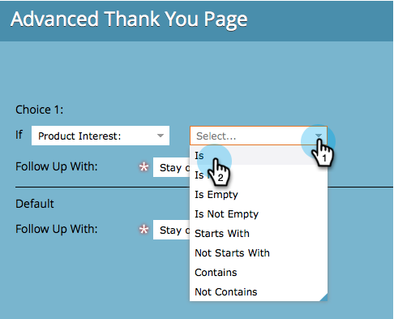

# Définition d’une page de remerciement de formulaire {#set-a-form-thank-you-page}

Que se passe-t-il quand quelqu’un remplit un formulaire ? Où sont-ils transférés ? Voici comment le configurer.

## Modifier le formulaire {#edit-form}

1. Accédez à **Activités marketing**.

   

1. Sélectionnez votre formulaire et cliquez sur **Modifier le formulaire**.

   

1. Sous **Paramètres de formulaire**, cliquez sur **Paramètres**.

   

1. Faites défiler jusqu’à la section **Page de remerciement**.

## Rester sur la page {#stay-on-page}

L’option Rester sur la page permet de conserver le visiteur sur la même page une fois le formulaire envoyé.

1. Sélectionnez **Rester sur la page** pour **Effectuer un suivi avec**.

   

## URL externe {#external-url}

Le paramètre URL externe vous permet de définir n’importe quelle URL comme page de suivi. Une fois le formulaire envoyé, l’utilisateur est redirigé vers l’URL spécifiée.

1. Sélectionnez **URL externe** pour **Effectuer un suivi avec**.

   

1. Saisissez l’URL complète.

   

>[!TIP]
>
>L’URL peut être celle d’un fichier hébergé quelque part. Dans ce cas, le bouton &quot;Envoyer&quot; se comporte comme un bouton &quot;Télécharger&quot;.

## Page de destination {#landing-page}

Vous pouvez sélectionner n’importe quelle page d’entrée Marketo approuvée comme suivi.

1. Définissez **Follow Up With** sur **Landing Page**.

   

1. Recherchez et sélectionnez la landing page de votre choix.

   

## Pages de remerciement dynamiques {#dynamic-thank-you-pages}

Vous pouvez ajouter plusieurs options et intégrer des choix pour afficher aux personnes différents suivis en fonction de leurs réponses.

1. Cliquez sur **Ajouter un choix**.

   

1. Sélectionnez le champ dont vous souhaitez surveiller la réponse.

   

   >[!TIP]
   >
   >Seuls les champs ajoutés au formulaire sont disponibles pour cela.

1. Sélectionnez l’opérateur logique de votre choix.

   

1. Saisissez l’une des valeurs auxquelles l’utilisateur répondra.

   

1. Sélectionnez la page appropriée pour le type **Follow Up With** .

   

1. Sélectionnez la landing page appropriée.

   

   >[!NOTE]
   >
   >Vous devez avoir préalablement créé/approuvé ces landing pages.

1. Cliquez sur le signe **+** pour ajouter un autre choix.

   

   >[!NOTE]
   >
   >Vous pouvez ajouter plusieurs choix. Si vous en ajoutez trop, toutefois, cela peut avoir une incidence sur la vitesse de chargement du formulaire. Il suffit donc d’ajouter ce dont vous avez besoin.

1. Parcourez et configurez **Choix 2**.

   

   >[!TIP]
   >
   >N’hésitez pas à mélanger et à associer des types de relance. Vous pouvez utiliser une landing page pour un choix et une URL pour un autre.

1. Définissez une page par défaut pour toutes les autres réponses.

   

1. Sélectionnez la page elle-même et cliquez sur **Enregistrer**.

   

   OK, ça a l&#39;air bien !

   

1. Cliquez sur **Terminer**.

   

1. Cliquez sur **Approuver et fermer**.

   

Bon boulot !
