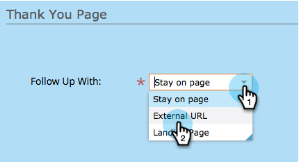

# Définir une page de remerciement de formulaire {#set-a-form-thank-you-page}

Que se passe-t-il lorsque quelqu’un remplit un formulaire ? Où sont-ils transférés ? Voici comment le configurer.

## Modifier le formulaire {#edit-form}

1. Accédez à **Marketing** **Activités**.

   

1. Sélectionnez votre formulaire et cliquez sur **Modifier le formulaire**.

   

1. Sous **Formulaire** **Paramètres** cliquez sur **Paramètres**.

   

1. Faites défiler l&#39;écran jusqu&#39;à la section **Merci** **Vous** **Page**.

## Rester sur la page {#stay-on-page}

L’option Rester sur la page permet de conserver le visiteur sur la même page lorsque le formulaire a été envoyé.

1. Sélectionnez **Séjour** **On** **Page** pour **Suivre** **Haut** **Avec**.

   

## URL externe {#external-url}

Le paramètre URL externe vous permet de définir toute URL comme page de suivi. Une fois que l’utilisateur a envoyé le formulaire, il est redirigé vers l’URL spécifiée.

1. Sélectionnez **External** **URL** pour **Suivre** **Haut** **Avec**.

   

1. Saisissez l’URL complète.

   

>[!TIP]
>
>L’URL peut être celle d’un fichier hébergé quelque part. Si vous le faites, le bouton &quot;Envoyer&quot; se comportera comme un bouton &quot;Télécharger&quot;.

## landing page {#landing-page}

Vous pouvez sélectionner n’importe quel landing page Marketo approuvé comme suivi.

1. Définissez **Suivi avec** sur **Landing page**.

   

1. Recherchez et sélectionnez le landing page de votre choix.

   

## Pages de remerciement dynamiques {#dynamic-thank-you-pages}

Vous pouvez ajouter plusieurs options et intégrer des choix afin d’afficher différents suivis de personnes en fonction de leurs réponses.

1. Cliquez sur **Ajouter** **Choix**.

   

1. Sélectionnez le champ dont vous souhaitez surveiller la réponse.

   

   >[!TIP]
   >
   >Seuls les champs ajoutés au formulaire sont disponibles pour cela.

1. Sélectionnez l’opérateur logique de votre choix.

   

1. Entrez l&#39;une des valeurs auxquelles l&#39;utilisateur répondra.

   

1. Sélectionnez la page appropriée pour le type **Suivre** **Haut** **Avec**.

   

1. Sélectionnez le landing page approprié.

   

   >[!NOTE]
   >
   >**Rappel**
   >
   >
   >Vous devez avoir créé/approuvé ces landings page à l’avance.

1. Cliquez sur le signe **+** pour ajouter un autre choix.

   

   >[!NOTE]
   >
   >Vous pouvez ajouter plusieurs options. Cependant, si vous en ajoutez trop, cela peut affecter la vitesse de chargement du formulaire. N’ajoutez donc que ce dont vous avez besoin.

1. Parcourez et configurez **Choice** **2**.

   

   >[!TIP]
   >
   >N&#39;hésitez pas à mélanger et à faire correspondre des types de suivi. Vous pouvez utiliser un landing page pour un choix et une URL pour un autre.

1. Définissez une page par défaut pour toutes les autres réponses.

   

1. Sélectionnez la page elle-même et cliquez sur **Enregistrer**.

   

   OK, ça a l&#39;air bien !

   

1. Cliquez sur **Terminer**.

   

1. Cliquez sur **Approuver et fermer**.

   

Super boulot !
