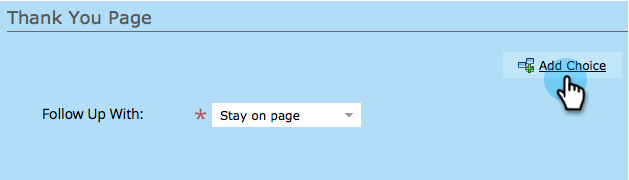
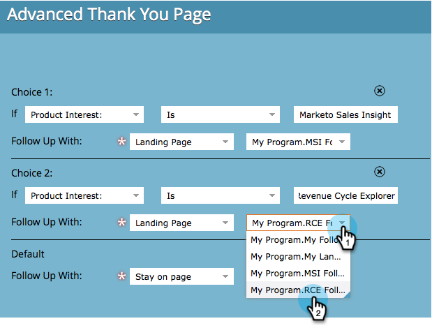

# Définir un formulaire de page de remerciement {#set-a-form-thank-you-page}

Que se passe-t-il lorsqu’une personne remplit un formulaire ? Où sont-ils transférés ? Voici comment le configurer.

## Modifier le formulaire {#edit-form}

1. Accédez à **[!UICONTROL Activités marketing]**.

   

1. Sélectionnez votre formulaire et cliquez sur **[!UICONTROL Modifier le formulaire]**.

   

1. Sous **[!UICONTROL Paramètres du formulaire]** cliquez sur **[!UICONTROL Paramètres]**.

   

1. Faites défiler l’écran jusqu’à la section **[!UICONTROL Page de remerciement]**.

## Rester Sur La Page {#stay-on-page}

L’option Rester sur la page permet de conserver le visiteur sur la même page après l’envoi du formulaire.

1. Sélectionnez **[!UICONTROL Rester sur la page]** pour **[!UICONTROL suivi avec]**.

   

## URL externe {#external-url}

Le paramètre URL externe vous permet de définir n’importe quelle URL comme page de suivi. Une fois que l’utilisateur a envoyé le formulaire, il est redirigé vers l’URL spécifiée.

1. Sélectionnez **[!UICONTROL URL externe]** pour **[!UICONTROL Suivre avec]**.

   

1. Saisissez l’URL complète.

   

>[!TIP]
>
>L’URL peut être celle d’un fichier hébergé quelque part. Si vous procédez de la sorte, le bouton « [!UICONTROL &#x200B; Envoyer &#x200B;] » se comportera comme un bouton « [!UICONTROL &#x200B; Télécharger &#x200B;] ».

## Page de destination {#landing-page}

Vous pouvez sélectionner n’importe quelle page de destination Marketo approuvée en tant que relance.

1. Définissez **[!UICONTROL Suivi avec]** sur **[!UICONTROL Page de destination]**.

   

1. Recherchez et sélectionnez la page de destination souhaitée.

   

## Pages de remerciement dynamiques {#dynamic-thank-you-pages}

Vous pouvez ajouter plusieurs options et créer des choix pour montrer aux personnes différents suivis en fonction de leurs réponses.

1. Cliquez sur **[!UICONTROL Ajouter un choix]**.

   

1. Sélectionnez le champ dont vous souhaitez surveiller la réponse.

   

   >[!TIP]
   >
   >Seuls les champs ajoutés au formulaire sont disponibles pour cette opération.

1. Sélectionnez l’opérateur logique de votre choix.

   

1. Saisissez l’une des valeurs auxquelles l’utilisateur répondra.

   

1. Sélectionnez la page appropriée pour le type **[!UICONTROL Suivi avec]**.

   

1. Sélectionnez la page de destination appropriée.

   

   >[!NOTE]
   >
   >Vous devez avoir créé/approuvé ces pages de destination à l’avance.

1. Cliquez sur le signe **+** pour ajouter un autre choix.

   

   >[!NOTE]
   >
   >Vous pouvez ajouter plusieurs choix. Cependant, si vous en ajoutez trop, cela peut affecter la vitesse de chargement du formulaire. Ajoutez donc uniquement ce dont vous avez besoin.

1. Parcourez et configurez **[!UICONTROL Choix 2]**.

   

   >[!TIP]
   >
   >N’hésitez pas à mélanger et à faire correspondre les types de suivi. Vous pouvez utiliser une page de destination pour un choix et une URL pour un autre.

1. Définissez une page par défaut pour toutes les autres réponses.

   

1. Sélectionnez la page elle-même et cliquez sur **[!UICONTROL Enregistrer]**.

   

   OK, ça a l&#39;air bien !

   

1. Cliquez sur **[!UICONTROL Terminer]**.

   

1. Cliquez sur **[!UICONTROL Approuver et fermer]**.

   

Bon boulot !
