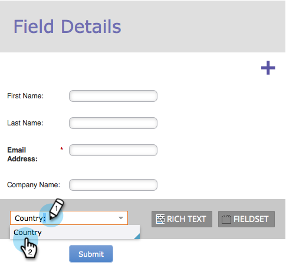

# Ajouter une liste de sélection de pays à votre formulaire {#add-a-country-picklist-to-your-form}

Suivez ces instructions pour convertir le champ pays en liste déroulante avec une liste de tous les pays.

1. Accédez à **[!UICONTROL Activités marketing]**.

   

1. Sélectionnez votre formulaire et cliquez sur **[!UICONTROL Modifier le formulaire]**.

   

1. Cliquez sur le signe **+**.

   

1. Recherchez et sélectionnez **[!UICONTROL Pays]**.

   

1. Lorsque le champ **[!UICONTROL Pays]** est sélectionné, remplacez **[!UICONTROL Type de champ]** par **[!UICONTROL Sélectionner]**.

   

1. **[!UICONTROL Modifiez]** le **[!UICONTROL Valeurs]** pour ajouter la liste des pays parmi lesquels les utilisateurs peuvent choisir.

   

1. Cliquez sur **[!UICONTROL Éditeur avancé]**.

   

1. Sélectionnez et copiez cette liste de pays :

   ```
   Afghanistan Albania Algeria Andorra Angola Antigua & Deps Argentina Armenia Australia Austria Azerbaijan Bahamas Bahrain Bangladesh Barbados Belarus Belgium Belize Benin Bhutan Bolivia Bosnia Herzegovina Botswana Brazil Brunei Bulgaria Burkina Burundi Cambodia Cameroon Canada Cape Verde Central African Rep Chad Chile China Colombia Comoros Congo Congo (Democratic Rep) Costa Rica Croatia Cuba Cyprus Czech Republic Denmark Djibouti Dominica Dominican Republic East Timor Ecuador Egypt El Salvador Equatorial Guinea Eritrea Estonia Ethiopia Fiji Finland France Gabon Gambia Georgia Germany Ghana Greece Grenada Guatemala Guinea Guinea-Bissau Guyana Haiti Honduras Hungary Iceland India Indonesia Iran Iraq Ireland (Republic) Israel Italy Ivory Coast Jamaica Japan Jordan Kazakhstan Kenya Kiribati Korea North Korea South Kosovo Kuwait Kyrgyzstan Laos Latvia Lebanon Lesotho Liberia Libya Liechtenstein Lithuania Luxembourg Macedonia Madagascar Malawi Malaysia Maldives Mali Malta Marshall Islands Mauritania Mauritius Mexico Micronesia Moldova Monaco Mongolia Montenegro Morocco Mozambique Myanmar (Burma) Namibia Nauru Nepal Netherlands New Zealand Nicaragua Niger Nigeria Norway Oman Pakistan Palau Panama Papua New Guinea Paraguay Peru Philippines Poland Portugal Qatar Romania Russian Federation Rwanda St Kitts & Nevis St Lucia Saint Vincent & the Grenadines Samoa San Marino Sao Tome & Principe Saudi Arabia Senegal Serbia Seychelles Sierra Leone Singapore Slovakia Slovenia Solomon Islands Somalia South Africa South Sudan Spain Sri Lanka Sudan Suriname Swaziland Sweden Switzerland Syria Taiwan Tajikistan Tanzania Thailand Togo Tonga Trinidad & Tobago Tunisia Turkey Turkmenistan Tuvalu Uganda Ukraine United Arab Emirates United Kingdom United States Uruguay Uzbekistan Vanuatu Vatican City Venezuela Vietnam Yemen Zambia Zimbabwe
   ```

1. Collez la liste dans l’éditeur.

   

   >[!TIP]
   >
   >N’hésitez pas à modifier la liste ou à en utiliser une autre.

1. Cliquez sur **[!UICONTROL Enregistrer]**

   

1. Cliquez sur **[!UICONTROL Terminer]**.

   

1. Cliquez sur **[!UICONTROL Approuver et fermer]**.

   

   Bien joué ! Désormais, lorsqu’une personne remplit votre formulaire, elle peut choisir parmi les pays que vous avez fournis.

   

Puisque c&#39;était si facile, pourquoi ne pas en faire plus ? Que diriez-vous d’afficher de manière dynamique le champ État lorsqu’un utilisateur sélectionne États-Unis comme pays dans la liste ? Consultez l’article connexe ci-dessous pour savoir comment procéder.

>[!MORELIKETHIS]
>
>[Activer/désactiver la visibilité dynamique d’un champ de formulaire](/help/marketo/product-docs/demand-generation/forms/form-fields/dynamically-toggle-visibility-of-a-form-field.md)
