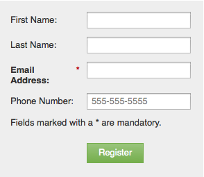

# Ajouter du texte enrichi à un formulaire {#add-rich-text-to-a-form}

Utilisez le texte enrichi dans un formulaire pour ajouter des instructions ou d’autres informations entre les champs.

1. Accédez à **[!UICONTROL Activités marketing]**.

   

1. Sélectionnez votre formulaire et cliquez sur **[!UICONTROL Modifier le formulaire]**.

   

1. Cliquez sur le signe **+**.

   

1. Sélectionnez **[!UICONTROL Texte enrichi]**.

   

1. Saisissez le texte souhaité.

   

   >[!TIP]
   >
   >Si votre formulaire a besoin d&#39;un séparateur de ligne, utilisez le bouton Ligne horizontale .

1. Cliquez sur **[!UICONTROL Enregistrer]**

   

1. Cliquez sur **[!UICONTROL Terminer]**.

   

1. Cliquez sur **[!UICONTROL Approuver et fermer]**.

   

   

>[!TIP]
>
>Saviez-vous que vous pouvez également [ajouter des règles de visibilité](/help/marketo/product-docs/demand-generation/forms/form-fields/dynamically-toggle-visibility-of-a-form-field.md) à un bloc de texte enrichi ?
