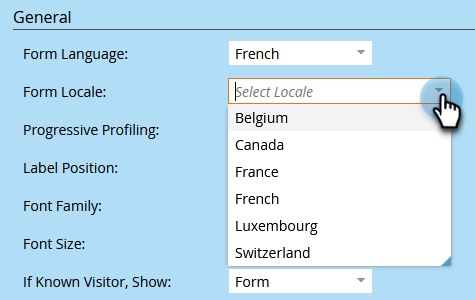
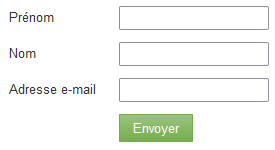

# Modifier la langue d’un formulaire {#change-the-language-of-a-form}

Découvrez comment modifier la langue de votre formulaire.

>[!IMPORTANT]
>
>La procédure décrite dans cet article modifie la langue des champs standard de Marketo, ainsi que la formulation utilisée dans le libellé du bouton Envoyer . Il ne traduira pas [champs personnalisés](/help/marketo/product-docs/administration/field-management/create-a-custom-field-in-marketo.md){target="_blank"}.

1. Accédez à **Activités marketing**.

   

1. Sélectionnez votre formulaire et cliquez sur **Modifier le formulaire**.

   

1. Cliquez sur **Paramètres du formulaire** et sélectionnez **Paramètres**.

   

1. Sélectionnez la **langue du formulaire** souhaitée.

   

   ÉTAPE FACULTATIVE : Choisissez le paramètre régional de la langue sélectionnée.

   

1. Cliquez sur **Terminer**.

   

1. Cliquez sur **Approuver et fermer** pour appliquer et enregistrer les modifications.

   

   >[!NOTE]
   >
   >Le formulaire doit être approuvé pour être utilisé sur les pages de destination.

   >[!TIP]
   >
   >N’oubliez pas d’[approuver le brouillon de la page de destination](/help/marketo/product-docs/demand-generation/landing-pages/understanding-landing-pages/approve-unapprove-or-delete-a-landing-page.md) créé par les modifications du formulaire.

Votre formulaire reflète désormais la langue que vous avez sélectionnée.

