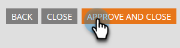

# Modification de la langue d’un formulaire {#change-the-language-of-a-form}

Découvrez comment modifier la langue de votre formulaire.

1. Accédez à **Activités marketing**.

   

1. Sélectionnez votre formulaire et cliquez sur **Modifier le formulaire**.

   

1. Cliquez sur **Paramètres de formulaire** et sélectionnez **Paramètres**.

   

1. Sélectionnez la **langue du formulaire** de votre choix.

   

   ÉTAPE FACULTATIVE : choisissez la langue/la région de votre langue sélectionnée.

   

1. Cliquez sur **Terminer**.

   

1. Cliquez sur **Approuver et fermer** pour appliquer et enregistrer les modifications.

   

   >[!NOTE]
   >
   >Le formulaire doit être validé pour être utilisé sur les landing pages.

   >[!TIP]
   >
   >N’oubliez pas d’ [approuver le brouillon de la landing page](/help/marketo/product-docs/demand-generation/landing-pages/understanding-landing-pages/approve-unapprove-or-delete-a-landing-page.md) créé par les modifications du formulaire.

Votre formulaire reflète désormais la langue que vous avez sélectionnée.

