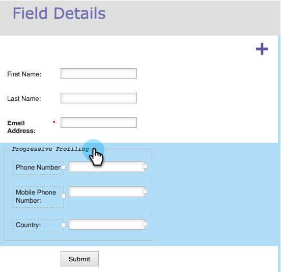

# Configurer le profilage progressif de formulaire {#configure-form-progressive-profiling}

Les formes courtes sont bonnes ! Lorsqu’une personne revient sur un formulaire, vous pouvez présenter de nouveaux champs et remplir progressivement le profil du visiteur. Voici comment procéder.

>[!NOTE]
>
>Pour que cette fonctionnalité fonctionne correctement, assurez-vous que le préremplissage du formulaire est activé pour les champs visibles et [ désactivé](/help/marketo/product-docs/demand-generation/forms/form-fields/disable-pre-fill-for-a-form-field.md) pour les champs masqués.

1. Accédez à **[!UICONTROL Activités marketing]**.

   

1. Sélectionnez votre formulaire et cliquez sur **[!UICONTROL Modifier le formulaire]**.

   

1. Sous **[!UICONTROL Paramètres du formulaire]**, cliquez sur **[!UICONTROL Paramètres]**.

   

1. Définissez **[!UICONTROL Profilage progressif]** sur **[!UICONTROL Activé]**.

   

1. Ok, maintenant configurons-le. Accédez à **[!UICONTROL Détails du champ]**.

   

1. Faites glisser et déposez tous les champs qui font partie de l’ensemble de profils progressifs.

   

1. Une fois tous les champs déplacés, ils doivent se présenter comme suit :

   

   >[!NOTE]
   >
   >Les champs situés en dehors de la zone **[!UICONTROL Profilage progressif]** s’affichent toujours dans le formulaire, même s’ils sont remplis.

1. Sélectionnez la case **[!UICONTROL Profilage progressif]**.

   

   >[!CAUTION]
   >
   >Soyez prudent lorsque vous utilisez des champs obligatoires dans [!UICONTROL Profilage progressif]. Ces champs peuvent toujours être laissés vides si le visiteur saisit une nouvelle adresse e-mail (ce qui créerait une nouvelle personne) après avoir envoyé précédemment des données pour les autres champs, car ils seraient supprimés sur le dernier formulaire.

1. Choisissez maintenant le nombre de champs vides que vous souhaitez que les personnes voient dans la zone **Profilage progressif** à tout moment donné.

   

   >[!NOTE]
   >
   >Si vous choisissez **[!UICONTROL Nombre de champs vierges]** sur 1, les éléments suivants s’afficheront la première fois que ce formulaire sera affiché :
   >
   >* Prénom (vide)
   >* Nom (vide)
   >* Adresse Email (vide)
   >* Numéro de téléphone (vide)
   >
   >En supposant qu’ils remplissent tous les champs, la deuxième fois qu’ils visitent, ils verront :
   >
   >* Prénom (prérempli)
   >* Nom (prérempli)
   >* Adresse e-mail (préremplie)
   >* Numéro de téléphone mobile (vide)
   >
   >En supposant qu’ils remplissent le numéro de téléphone mobile, la troisième fois qu’ils visitent , ils voient :
   >
   >* Prénom (prérempli)
   >* Nom (prérempli)
   >* Adresse e-mail (préremplie)
   >* Pays (vide)

1. Cliquez sur **[!UICONTROL Terminer]**.

   

1. Cliquez sur **[!UICONTROL Approuver et fermer]**.

   

Joli travail ! Le travail que vous venez de faire sera payant.

Testez cette fonctionnalité et veillez à la tester. Il est avancé, mais vous pouvez rendre vos formulaires très dynamiques de cette manière.
