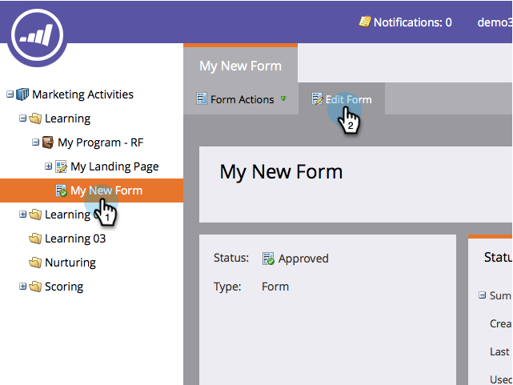

# Définir des valeurs dans une case d’option ou un champ sélectionné dans un formulaire {#define-values-in-a-radio-or-selected-field-in-a-form}

Une fois que vous avez [défini un type de champ](/help/marketo/product-docs/administration/field-management/change-the-type-of-a-marketo-custom-field.md) pour être un bouton radio ou un type de sélection, vous devez définir les valeurs que l’utilisateur peut sélectionner. Voici comment faire.

1. Accédez à **[!UICONTROL Activités marketing]**.

   

1. Sélectionnez votre formulaire et cliquez sur **[!UICONTROL Modifier le formulaire]**.

   

1. Sélectionnez le champ et cliquez sur **[!UICONTROL Modifier]**.

   

   >[!NOTE]
   >
   >La première valeur et la valeur par défaut sont toujours « [!UICONTROL Sélectionner...] » N’hésitez pas à le modifier. Si vous modifiez le bouton radio par défaut pour une autre ligne, « [!UICONTROL Sélectionner...] » n’apparaîtra pas en tant que choix dans le formulaire.

1. Cliquez pour ajouter votre valeur.

   

   >[!NOTE]
   >
   >**Définition**
   >
   >**[!UICONTROL Valeur d’affichage] :** ce qui est présenté au visiteur.
   >
   >**[!UICONTROL Valeur stockée] :** ce qui est enregistré dans Marketo.

1. Ajoutez autant de valeurs que nécessaire, puis cliquez sur **[!UICONTROL Enregistrer]**.

   >[!NOTE]
   >
   >Si vous ne saisissez pas de [!UICONTROL Valeur stockée], Marketo utilise la [!UICONTROL Valeur d’affichage] et la stocke.

   

   >[!TIP]
   >
   >Cliquez sur **[!UICONTROL Éditeur avancé]** pour copier/coller une liste de valeurs si vous le souhaitez. Cela peut vous faire gagner du temps.

1. Cliquez sur **[!UICONTROL Terminer]**.

   

1. Cliquez sur **[!UICONTROL Approuver et fermer]**.

   
