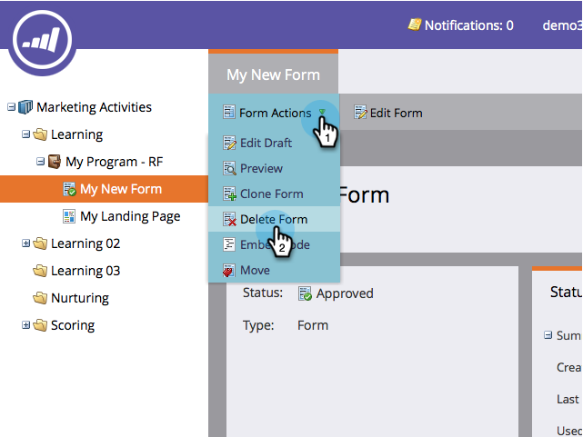

# Supprimer un formulaire {#delete-a-form}

Si vous disposez d’un formulaire dont vous n’avez pas besoin et qui n’est pas utilisé, vous pouvez le supprimer. Voici comment faire.

1. Accédez à **[!UICONTROL Activités marketing]**.

   

1. Recherchez et sélectionnez votre formulaire.

   

1. Sous **[!UICONTROL Actions de formulaire]**, cliquez sur **[!UICONTROL Supprimer le formulaire]**.

   

   >[!NOTE]
   >
   >N’oubliez pas de supprimer le formulaire de toutes les pages de destination qui l’utilisent. Vérifiez également que le formulaire n’est pas utilisé sur un site web public.

1. Confirmez en cliquant sur **[!UICONTROL Supprimer]**.

   

1. Si le formulaire est utilisé sur une page de destination Marketo, vous ne serez pas autorisé à le supprimer. Vous devez aller le supprimer des pages de destination sur lesquelles il réside.

   

>[!CAUTION]
>
>Si vous supprimez un formulaire utilisé par votre site web public, vous ne verrez pas d’avertissement et le formulaire sera endommagé. Envisagez plutôt de [l’archiver](/help/marketo/product-docs/email-marketing/drip-nurturing/using-stream-content/archive-and-unarchive-stream-content.md).
