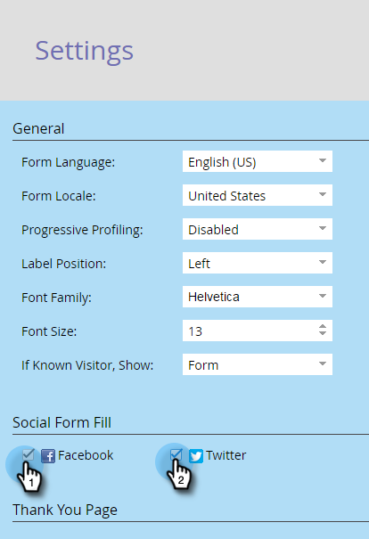

# Activer le remplissage du formulaire social sur un formulaire {#enable-social-form-fill-on-a-form}

Autorisez vos visiteurs et visiteuses à remplir le formulaire à l’aide de leur réseau social. Vous obtiendrez automatiquement des données supplémentaires et ils obtiendront une expérience plus rapide.

>[!AVAILABILITY]
>
>Tous les utilisateurs de Marketo Engage n’ont pas acheté cette fonctionnalité. Pour plus d’informations, contactez l’équipe du compte Adobe (votre gestionnaire de compte).

1. Accédez à **[!UICONTROL Activités marketing]**.

   

1. Sélectionnez votre formulaire et cliquez sur **[!UICONTROL Modifier le formulaire]**.

   

1. Sous **[!UICONTROL Paramètres du formulaire]** cliquez sur **[!UICONTROL Paramètres]**.

   

1. Cochez les boutons du réseau social que vous souhaitez inclure.

   

   >[!TIP]
   >
   >Examinez ce que _les données Marketo captureront_ si les utilisateurs utilisent les boutons de réseaux sociaux.

1. Cliquez sur **[!UICONTROL Terminer]**.

   

1. Cliquez sur **[!UICONTROL Approuver et fermer]**.

   

   Le voilà.

   

Plutôt génial, hein ?
