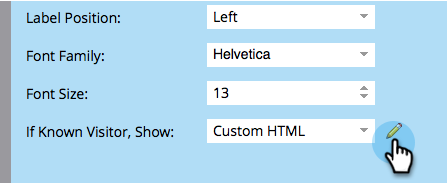

# Afficher un formulaire HTML personnalisé pour les personnes connues {#show-custom-html-form-for-known-people}

Si un visiteur fait l&#39;objet d&#39;un cookie (personne connue qui a fourni une adresse électronique dans le passé), pourquoi se soucier du formulaire ? Donnez-leur juste le bouton de téléchargement. Voici comment.

1. Accédez à **Marketing** **Activités**.

   

1. Sous **Activités** **marketing**, sélectionnez votre formulaire, puis cliquez sur **Modifier** **le formulaire.**

   

1. Sous **Paramètres** du formulaire **, cliquez sur** Paramètres ****.

   

1. Définissez Si **Connu** **Visiteur, Afficher**: au **code HTML** **personnalisé**.

   

1. Cliquez sur le  pour modifier le **code HTML** **personnalisé** qui sera présenté aux personnes connues.

   

1. Il y a du contenu par défaut, mais n&#39;hésitez pas à le modifier.

   

   Jetons disponibles :

   | Jeton | Description |
   |---|---|
   | `{{lead.FirstName}}` | Le prénom de la personne s&#39;affichera. |
   | `{{lead.LastName}}` | Le nom de famille de la personne s&#39;affichera alors. |
   | `{{form.Button:default=Download}}` | Le bouton du formulaire s’affiche alors. Remplacez la zone située après le bouton `=` pour modifier le texte du bouton. |
   | `{{form.NotYou:default=Not you?}}` | Ceci affiche un lien au cas où la personne serait une autre. Remplacez la zone située après le `=` pour modifier le texte du lien. |

   >[!CAUTION]
   >
   >Seuls les quatre jetons ci-dessus peuvent être utilisés. Aucun autre jeton ne fonctionnera ici.

1. Cliquez sur **Terminer**.

   

1. Cliquez sur **Approuver et fermer**.

   >[!NOTE]
   >
   >Le formulaire doit être approuvé pour être utilisé sur les landings page.

   

   >[!NOTE]
   >
   >**Rappel**
   >
   >
   >Pensez à [approuver le brouillon](../../../../product-docs/demand-generation/landing-pages/understanding-landing-pages/approve-unapprove-or-delete-a-landing-page.md) de landing page créé par les modifications apportées au formulaire.

   

   >[!TIP]
   >
   >Vous pouvez diriger le clic sur le bouton vers la ressource en définissant la page de suivi de formulaire sur l’URL du fichier.

Un morceau de gâteau ! Voyez ce qu&#39;une personne verrait s&#39;elle revenait sur le même formulaire :