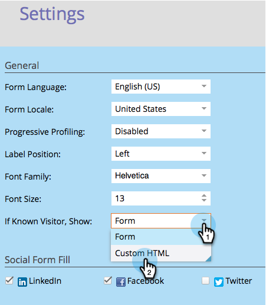

# Afficher un formulaire HTML personnalisé pour les personnes connues {#show-custom-html-form-for-known-people}

Si un visiteur a déjà indiqué son nom complet et son adresse e-mail et que vous ne souhaitez pas qu’il reçoive l’intégralité du formulaire, apprenez à lui montrer des HTML personnalisées (par exemple, un simple bouton de téléchargement).

1. Accédez à **Activités marketing**.

   

1. Sous **Activités marketing**, sélectionnez votre formulaire, puis cliquez sur **Modifier le formulaire**.

   

1. Sous **Paramètres du formulaire**, cliquez sur **Paramètres**.

   

1. Définissez Si **Visiteur connu, Afficher** : sur **HTML personnalisé**.

   

1. Cliquez sur le  pour modifier le **Custom HTML** qui sera présenté aux personnes connues.

   

1. Il existe du contenu par défaut, mais n’hésitez pas à le modifier.

   

   Jetons disponibles :

   | Jeton | Description |
   |---|---|
   | `{{lead.FirstName}}` | Le prénom de la personne s’affiche. |
   | `{{lead.LastName}}` | Le nom de la personne s’affiche. |
   | `{{form.Button:default=Download}}` | Le bouton de formulaire s’affiche. Remplacez la zone située après le `=` pour modifier le texte du bouton. |
   | `{{form.NotYou:default=Not you?}}` | Un lien s’affiche si la personne est une autre personne. Remplacez la zone située après la `=` pour modifier le texte du lien. |

   >[!CAUTION]
   >
   >Seuls les quatre jetons ci-dessus peuvent être utilisés. Aucun autre jeton ne fonctionnera ici.

1. Cliquez sur **Terminer**.

   

1. Cliquez sur **Approuver et fermer**.

   >[!NOTE]
   >
   >Le formulaire doit être approuvé pour être utilisé sur les pages de destination.

   

   >[!NOTE]
   >
   >N’oubliez pas de [approuver le brouillon de la page de destination](/help/marketo/product-docs/demand-generation/landing-pages/understanding-landing-pages/approve-unapprove-or-delete-a-landing-page.md) créé par les modifications du formulaire.

   Un morceau de gâteau ! Découvrez ce qu’une personne verrait si elle revenait au même formulaire :

   

   >[!TIP]
   >
   >Vous pouvez diriger le clic du bouton sur la ressource en définissant la page de suivi du formulaire sur l’URL du fichier.
